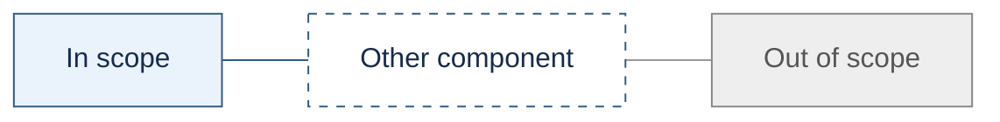
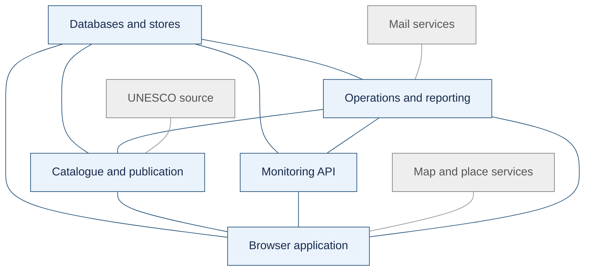
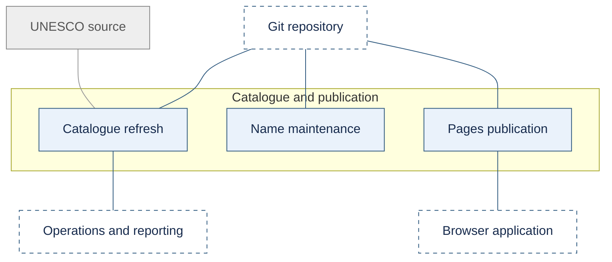
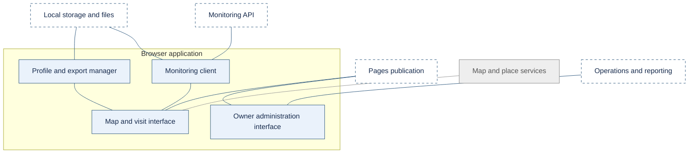
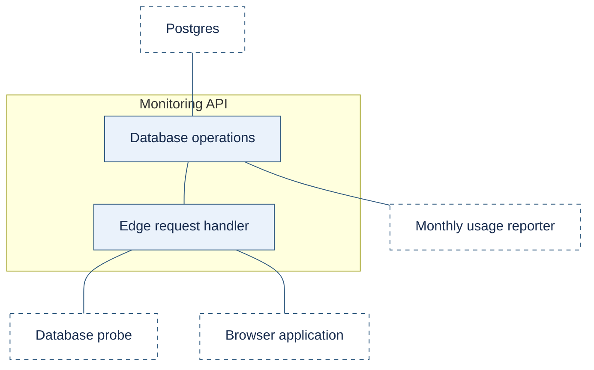
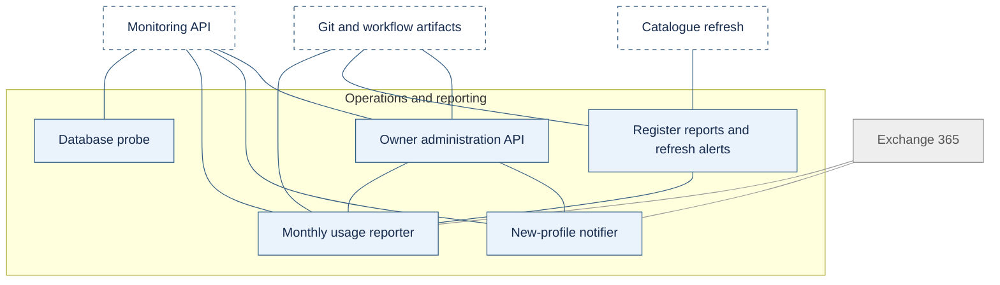
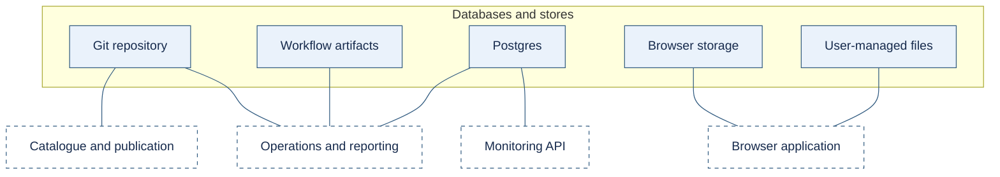

<!-- ARCHITECTURE.md -->
# My World Heritage — architecture specification

Reviewed 3 October 2026. This specification describes the implemented component structure and identifies remaining verification gaps. [Requirements](Requirements.md) defines intent; [System behaviour](SYSTEM_BEHAVIOUR.md) defines sequences; [Traceability](TRACEABILITY.md) connects them to implementation and evidence. Source review is not a new provider-configuration verification.

# Architectural approach

The system consists of static mapping and owner-administration interfaces, a Git-managed catalogue pipeline and optional Supabase monitoring. GitHub Actions runs catalogue processing; Supabase runs owner mail reporting. Profiles and visits stay on the user's device; Git retains catalogue history; Supabase holds accepted pseudonymous usage summaries. Monitoring failure must not prevent local profile use.

The catalogue shows current active or retired status. Git commits and ingestion tags support forensic investigation without a temporal site database.

# Diagram legend

*Figure Diagram legend* identifies delivery scope and neighbouring components. Grey connections involve services outside the delivery; our integration code remains in scope. Dashed blue blocks belong to another part of the delivered system. Lines show connections, not execution order.

*Figure Diagram legend*

# System overview

*Figure Application stack* places data sources and stores above the components that use them, with the browser at the bottom. The five delivered components each have a Level 2 view. Existing UNESCO, mapping and Exchange services remain outside delivery scope; our GitHub and Supabase configuration is included.

*Figure Application stack*

# Component views

The Level 2 diagrams expand the five components in *Figure Application stack*. *Table Component views* provides navigation; the sections after the diagrams specify behaviour and implementation details.

*Table Component views*

| Component | Decomposition |
| --- | --- |
| Catalogue and publication | *Figure Catalogue and publication* |
| Browser application | *Figure Browser application* |
| Monitoring API | *Figure Monitoring API* |
| Operations and reporting | *Figure Operations and reporting* |
| Databases and stores | *Figure Databases and stores* |

## Catalogue and publication

*Figure Catalogue and publication* separates refresh, name maintenance and static publication. The UNESCO source and Git store sit above these components; the browser sits below publication.

*Figure Catalogue and publication*

## Browser application

*Figure Browser application* separates the interface, profile management and monitoring client. The user interface sits below its supporting components and services.

*Figure Browser application*

## Monitoring API

*Figure Monitoring API* separates the public request handler from private database operations. The browser and probe use the public handler; monthly reporting uses the private statistics operation.

*Figure Monitoring API*

## Operations and reporting

*Figure Operations and reporting* separates independent probe and reporting components. Their services and stores sit above them. Supabase runs immediate new-profile notifications and their retries; GitHub Actions runs the probe and refresh report artifact; Supabase Cron runs the monthly email.

*Figure Operations and reporting*

## Databases and stores

*Figure Databases and stores* separates the five persistence mechanisms and places their consumers below them. No connection implies replication between stores.

*Figure Databases and stores*

# Components and responsibilities

*Table Component responsibilities* assigns implementation responsibilities to the components in the diagram hierarchy.

*Table Component responsibilities*

| Component | Responsibility | Implementation boundary |
| --- | --- | --- |
| Browser application | Map and list presentation, explicit search, root/component selection, visit logs, settings and profile lifecycle | [site/index.html](site/index.html) |
| Browser storage and export | Keep personal information local; preserve profile schema and visit IDs across export/import; generate self-contained HTML reports and map snapshots | Browser `localStorage`, user-managed `.profile` and exported files |
| Mapping services | Provide map tiles and place lookup; preserve attribution; use local catalogue search when geocoding is unavailable | Leaflet, OpenStreetMap tiles, Nominatim and the existing report-map provider |
| Catalogue pipeline | Fetch to staging, convert locally, reconcile identities and statuses, validate and publish | [update-unesco-data.yml](.github/workflows/update-unesco-data.yml), converter, reconciliation and validation scripts |
| Name maintenance | Maintain curated local-script names, language selectors, coverage and anomaly reports separately from routine catalogue ingestion | `data/mappings/` and name-maintenance scripts/workflow |
| Git repository and Pages | Preserve provenance and serve the static application and its current catalogue | `data/staging/`, `data/current/`, ingestion tags and GitHub Pages |
| Supabase Edge Function | Validate public requests, handle CORS, enforce the payload contract and return explicit acknowledgements or aggregate statistics | [handler.mjs](supabase/functions/usage-summary/handler.mjs) |
| Supabase Postgres | Store accepted submissions and enforce atomic duplicate/rate-limit rules; compute read-only aggregates | [SQL migration](supabase/migrations/202610010001_usage_summary.sql) |
| Database probe | Test the real database read path without writes or administrative credentials in the probe job | [supabase-probe.yml](.github/workflows/supabase-probe.yml), [probe_supabase.mjs](scripts/probe_supabase.mjs) |
| Owner reporting | Generate combined monthly user-activity and catalogue-change email through Exchange | Supabase monthly Edge Function and refresh artifacts; [monthly_usage_report.mjs](scripts/monthly_usage_report.mjs), [site_register_report.mjs](scripts/site_register_report.mjs) |
| New-profile notifier | Queue the first accepted profile report and send an immediate owner alert through Exchange Online | Supabase Edge Functions, private notification queue, Vault and retry scheduler |

# Data ownership and contracts

The [Supabase monitoring schema](supabase/SCHEMA.md) provides the application entity model for **Profiles**, **Submissions** and **Notifications**, with a Bachman legend and column definitions. It distinguishes declared foreign keys from associations maintained by the reporting logic.

*Table Data ownership* defines the authoritative content and lifecycle of the stores in *Figure Databases and stores*.

*Table Data ownership*

| Data | Authoritative location | Identity and lifecycle |
| --- | --- | --- |
| Saved UNESCO extract | `data/staging/unesco_source_raw.txt` at an ingestion commit | Retain each committed observation through Git; a generation timestamp is not proof of the original fetch time |
| Canonical site register | `data/current/unesco_official_sites.json` | `my-world-heritage-sites/v1`; roots use `WHS <id>`, components use `MWH <root>-<nnn>` |
| Map features | `data/current/unesco_official_sites.geojson` | Derived from the reconciled canonical register; IDs, statuses and coordinates must agree |
| Curated labels and policy | `data/mappings/` | Reviewed mappings supplement source labels; ordinary refreshes must not introduce unreviewed local-name guesses |
| Profiles and visits | User device and exported `.profile` files | Stable site IDs link visit logs to catalogue entries; no cloud profile database is introduced |
| Pending usage summary | Local profile state | Preserve the same submission ID, payload and captured usage total until acknowledged or explicitly resolved |
| Accepted usage summary | Supabase `public.usage_submissions` | Submission ID is unique; receipt time is server-generated; durable receipts support retries while retained |
| Known profiles and pending alerts | Supabase `known_usage_profiles` and `new_profile_notifications` | One queue item per newly seen profile; retain failed deliveries for retry; existing profiles do not generate retrospective alerts |
| Report artifacts | GitHub workflow artifacts | Monthly preview: 30 days; register text/JSON: 90 days. Git remains the permanent register history |

Supabase stores only the allowed summary fields: submission identity, submission and receipt timestamps, pseudonymous cookie, usage count, visited-site count, event type, client version and the existing profile Name when supplied. Historical records also retain activity/test/synthetic classification and their source label. It must not store home coordinates, individual visits, visit notes, user-agent strings or ingest tokens. There is no separate reporting-alias attribute.

Root/component identity and visit status are distinct from catalogue status. A retired catalogue entry can still have editable visits. An entry missing from an extract is not automatically evidence of official UNESCO delisting.

# Catalogue refresh and publication

The catalogue refresh follows these processing rules:

1. The monthly or manually triggered refresh captures the current repository commit as its comparison baseline and fetches the official source into staging.
2. Conversion reads the staged source, trusted name mappings and prior canonical catalogue. No live source requests occur inside conversion.
3. Reconciliation retains missing known entries as retired, reactivates matched entries and preserves existing visit keys. Match components by source reference; repeated references require location disambiguation. A revised reference may match only when both its component label and location agree exactly. Stop on ambiguity rather than silently moving visits.
4. A previously known root present in the source but lacking coordinates can retain its last known location and remain active. Record new source roots without a usable location in `unmapped_source_ids`. Do not confuse map eligibility with source absence.
5. Generate new synthetic components for multi-location roots. If a root later has only one location, preserve any already assigned component IDs needed for existing visits rather than deleting them.
6. Derive GeoJSON from the reconciled register. Validate candidate outputs, unique IDs, parent relationships, allowed statuses and finite coordinates before replacing current files. Flag suspicious source loss for review; the prepared implementation rejects a loss of more than 10% of active roots.
7. Commit the source and both current outputs together. After successful validation, create an annotated ingestion tag and push the branch and tag atomically. Serialise refresh jobs and fail conflicting pushes without force-pushing.
8. Pages publishes the static files. The refresh workflow retains run results and artifacts; the Supabase monthly reporter independently compares catalogue commits and includes changes in owner mail. A refresh does not itself invoke the monthly mail worker.

Conversion may accept an explicit timestamp for repeatable processing. Reprocessing the same source and prior register must not cause further semantic record changes. Git storage replaces duplicate snapshot paths; there is no application delta format and no requirement to rewrite historical commits.

On fetch failure, keep the last valid catalogue available and record the failed attempt where possible. A failure-only status commit must not receive a successful-ingestion tag. Conversion or validation failure must prevent publication of its candidate data. Failed refresh stages use the owner-alert path.

# Browser behaviour and external dependencies

The browser loads the published catalogue into the custom map viewer and uses the same stable IDs for lists, search, selection and visit logs. High-volume component groups follow the configured visibility threshold. Retired entries remain accessible for historical visit recording and show their catalogue status separately from personal visit status.

Profiles require no hosted account. Export/import preserves the profile schema, settings and visit history. Static report export includes attribution and linked site references; snapshot capture remains a presentation feature, unrelated to retired dataset snapshots.

Place search occurs only after an explicit user action. When the geocoding provider is unavailable, local ID/name/metadata search remains available. Local profile storage does not make the application fully offline: initial application/catalogue loading, map tiles and external place search depend on their respective services.

# Monitoring interfaces and submission processing

The application calls the Edge Function; it has no direct access to private database tables or functions. Database transactions and validation rules are specified below, not drawn as additional component levels.

The project is `fjqhgcegnphavatrchjb.supabase.co`. The public API boundary is `/functions/v1/usage-summary`.

*Table Monitoring interfaces* specifies the interfaces exposed by the monitoring components in *Figure Monitoring API*.

*Table Monitoring interfaces*

| Interface | Behaviour |
| --- | --- |
| `OPTIONS` | Respond to browser preflight for the configured origin and supported headers/methods |
| `POST` | Validate and allow-list a maximum 4,096 UTF-8 bytes; accept `adoption`, `manual` or `periodic`; invoke `accept_usage` |
| `GET ?stats=1` | Invoke `usage_stats` for the preceding 14 days and return aggregate active-profile and average visited-site values |
| Bare `GET` | Identify the service only; this is not a database health check |
| Private SQL `accept_usage(jsonb)` | Serialise same-cookie submissions, check durable duplicates, enforce limits and insert atomically |
| Private SQL `usage_stats(start_at, end_at)` | Read receipt-time aggregates for a requested interval |

Submission processing must obey these rules:

1. Capture a summary and usage-counter snapshot locally and assign a stable submission ID.
2. Send the allowed summary to the Edge Function. An optional ingest token may be checked, but app users do not need Supabase Auth accounts.
3. In one database transaction, acknowledge an identical existing submission before checking rate limits. Reject different content using the same ID. For a new submission, enforce the 30-second minimum interval and 12 accepted submissions per rolling hour, then insert the row.
4. Return an explicit acceptance or failure. Failed inserts must not leave false receipts or consume accepted-submission quota. Bound database contention and request timeouts; verify hosted concurrency before cutover.
5. Advance the browser's published-use counter only to the captured total after confirmed acceptance. Preserve retry identity if the response is lost. Clipboard fallback is a local copy, not a successful publication.

Public aggregate statistics must not expose individual cookies or rows. Statistics retrieval is separate from submission acceptance so an optional statistics failure cannot invalidate a committed receipt.

# Probe and reporting schedules

*Table Scheduled operations* defines when the catalogue and operations components run and what each run produces.

Supabase commits a new-profile alert with the first accepted submission for that profile, then starts delivery in an Edge background task. The private worker retries pending deliveries through Supabase Cron, using a Vault-held credential. Microsoft Graph sends from the authorised Exchange Online mailbox to pekka@data.co.za and retains a Sent Items copy. The sender needs Microsoft application authorisation; it does not use GitHub or the Supabase Auth email service.

*Table Scheduled operations*

| Operation | Trigger and period | Result |
| --- | --- | --- |
| Catalogue refresh | Monthly workflow schedule or manual dispatch | Validated catalogue commit/tag, artifacts and workflow result |
| New-profile alert | Immediately after first accepted profile report; Supabase checks failed or interrupted deliveries each minute with backoff | One durable alert per profile; Exchange acceptance recorded separately from submission acceptance |
| Database probe | 02:17, 10:17 and 19:17 UTC, each with independent random 0–90 second delay | Successful database read or failed Actions run; no data writes |
| Monthly usage report | First of month at 06:00 UTC (08:00 Africa/Johannesburg) | Email covering the preceding Johannesburg calendar month by server receipt time |
| Register report | Part of scheduled monthly mail or an explicit owner monthly check | Semantic changes between period-boundary catalogue commits, or explicit comparison failure |

Scheduled probing requires `MWH_SUPABASE_PROBE_ENABLED=true`. Manual diagnostics bypass this switch and the delay. Relevant pull requests run mocked tests only. The probe receives only `SUPABASE_URL`, calls the public database-backed statistics route, validates its response and logs no aggregate values. It is a best-effort activity/availability check, not a guarantee against provider pausing or delayed GitHub schedules.

A failed probe produces a failed Actions run, not an automatic SMTP email. The reporting jobs run independently; a job result is execution state rather than another application component.

Supabase Cron invokes the private monthly reporter at 08:00 Africa/Johannesburg on the first. Include zero-activity months, accepted submissions, active profiles, event counts, reported uses and the average visited-site count from each profile's latest submission in the period.

The same email includes additions, retirements, reactivations, changed attributes and unexpected removals between the catalogue commits immediately before the month boundaries. GitHub refreshes also save detailed change artifacts. Git preserves forensic records.

The combined monthly email goes to `pekka@data.co.za` through Exchange 365 using Supabase-held credentials. A failed catalogue comparison appears explicitly in the email. A failed mail dispatch is visible in cron and HTTP response logs; manual reruns may resend mail.

The immediate new-profile email also goes to `pekka@data.co.za`, through Exchange Online's HTTPS API. A lease prevents concurrent delivery of the same queue item. If Exchange accepts an email but its acknowledgement is lost, a retry can still deliver a duplicate; the notification identifier aids tracing but is not an Exchange idempotency guarantee. Graph acceptance does not itself confirm inbox receipt.

# Security and operational boundaries

*Table Access rules* defines access controls for the connections shown in the component views.

*Table Access rules*

| Boundary | Access rule |
| --- | --- |
| Browser to Pages/maps | Public content access; maintain attribution and user-controlled search |
| Browser to Supabase | Public Edge Function with CORS and validation; no direct table or private-RPC access |
| Edge Function to Postgres | Server-only service-role credentials; table RLS and grants deny ordinary clients |
| GitHub probe to Edge Function | Project URL only; no access token, service key or database password in this job |
| Monthly report to Postgres | Server-side GitHub secret permits aggregate query; never expose it in browser code or logs |
| Owner/agent/deployment tools | Owner GitHub sign-in; separate scoped Supabase credentials or connected integration for agent and CI operations |
| Reporting jobs to Exchange | Mailbox-scoped application credentials held in Supabase |
| Supabase notifier to Exchange Online | Dedicated Microsoft application permission restricted to the sender mailbox; application credential held in Supabase Secrets |

Owner dashboard login, a Supabase management token, a service-role key and a database password are different credentials with different purposes. GitHub's workflow token does not grant Supabase access. CORS and a browser-held ingest token are not substitutes for server validation or an abuse-control policy.

# Failure handling and recovery

*Table Failure handling* specifies the required outcome when a component or connection fails.

*Table Failure handling*

| Failure | Required outcome |
| --- | --- |
| Invalid/incomplete source or incompatible prior catalogue | Reject the candidate; preserve the last published valid register |
| Ambiguous component identity | Stop automatic reconciliation; produce review evidence; do not guess visit reassignment |
| Interrupted local output replacement | Restore canonical JSON and GeoJSON together from the same known-good commit; local file moves are not a filesystem transaction |
| Concurrent repository update or failed push | Fail safely; refresh/review the branch and retry without force-pushing |
| Supabase failure or lost acknowledgement | Keep app/profile features usable, preserve the pending summary and retry with the same ID |
| Failed database probe | Fail the Actions run; investigate the endpoint or resume the project through owner administration if required |
| Exchange delivery failure | Preserve the report artifact and make failure visible; it does not undo an accepted submission or catalogue commit |
| Required dataset rollback | Restore the raw source and both outputs from a single Git checkpoint, validate and publish a new commit |

Supabase production backup/restore procedures and submission-retention duration must be selected for the deployed project. Do not assume a backup capability from the local tests. Any future deletion policy must preserve the promised retry/receipt behaviour for its documented retention window.

# Requirements coverage and acceptance

*Table Requirements coverage* maps the requirements to architectural provisions and acceptance evidence.

*Table Requirements coverage*

| Requirement group | Architectural provision | Acceptance evidence |
| --- | --- | --- |
| Current, auditable catalogue | Staged source, reconciliation, validation, stable outputs and Git tags | Repeat processing, provenance recovery and actual JSON/GeoJSON agreement |
| Retired-site continuity | Retain old entries and stable component keys; show catalogue status separately | Missing/reappearing roots/components; visit editing and profile import/export |
| Map, search and user control | Static viewer, explicit geocoding, local state, component grouping and portable exports | Browser map/search/visit/export checks without requiring monitoring availability |
| Curated local labels | Separate mapping and language-policy maintenance | Coverage/anomaly reports and unchanged unreviewed names |
| Reliable optional monitoring | Edge validation, transactional receipts, pending local summaries and private SQL access | Real-origin submission, duplicate/concurrent retries, failed writes and counter checks |
| Database activity monitoring | Randomised read-only probe | Mock tests plus successful live Postgres-backed response before activation |
| Owner feedback | Combined monthly reporting through Supabase/Exchange | Accurate period/change reports, zero-change cases and verified delivery |
| Operational recovery | Git rollback, visible failures and staged backend cutover | Workflow failure tests, paired dataset restoration and deployed backend verification |

The detailed checks remain in [TEST_PLAN.md](TEST_PLAN.md). Local tests establish code behaviour; they do not establish deployed credentials, hosted concurrency, browser connectivity, Pages publication or email delivery.

# Deployment sequence and known gaps

The canonical [Supabase application](https://pekka-28.github.io/unesco/site/) contains the latest client. The former `/site-supabase/` preview is a redirect only. Both addresses reach the same application and retain the existing browser profile and visit history. The Pages workflow publishes an explicit file allowlist; archived implementations, backend sources and build tooling remain outside the web distribution. See [Retired code](RETIRED_CODE.md).

The canonical client, owner administration, usage/notification/monthly functions and ordered schema migrations are deployed through the GitHub release path. The historical workbook import and Name/source maintenance are complete; [Schema](supabase/SCHEMA.md#historical-import) records import counts and migration traceability. The owner confirmed initial and monthly mail receipt. These are recorded delivery facts, not a new end-to-end test in this review.

Remaining work is tracked separately from completed cutover. [Security policy](SECURITY.md) and Issues [33](https://github.com/pekka-28/unesco/issues/33) and [36](https://github.com/pekka-28/unesco/issues/36) retain runtime/release isolation, audit activation/coverage and recovery evidence gaps. Catalogue recovery exceptions were recorded in a local provenance audit outside this published baseline; they are not evidence of a pending Supabase import. Published source and mapping evidence is in [staging](data/staging) and [mapping reports](data/mappings). [Traceability](TRACEABILITY.md) identifies source, test and deployment evidence and highlights indirect behaviours.

The design adds no cloud profile synchronisation, temporal site database or visitor-account requirement. Future localisation and private custom datasets remain backlog items.

# System behaviour

[System behaviour](SYSTEM_BEHAVIOUR.md) defines the canonical use-case MSCs, including local profile operations, exports, visitor requests, accepted submissions, notification delivery, owner authentication and commands, monthly reporting and release. It also defines the reminder and startup-help timers. The security assessment references these sequences and adds authority, exposure and evidence analysis rather than duplicating the diagrams.

# Security boundary

Owner administration belongs to operations and reporting. It exposes bounded inspection and named owner-mail operations, with no site-changing API or workflow dispatch credential. Production changes originate in GitHub; native Supabase integration releases the backend and GitHub Pages publishes the browser distribution. [Security policy](SECURITY.md) defines executing-component authentication, delegated service authority, asset protection and residual risks.

# Service dependencies and replacement

[Service dependencies and configuration](SERVICE_DEPENDENCIES.md) identifies each partner purpose, exchanged information, actual setting location, configuration authority and replacement contract. Its component continuity and handover procedure cover stores, browser state, pending mail, release history and independent deployment verification. Provider administrators own provider settings; tooling may retain references and validate expectations but must not administer them. Centralisation is proposed, not implemented. The same document states the browser-only TypeScript assurance boundary and the untyped server JavaScript gap.
