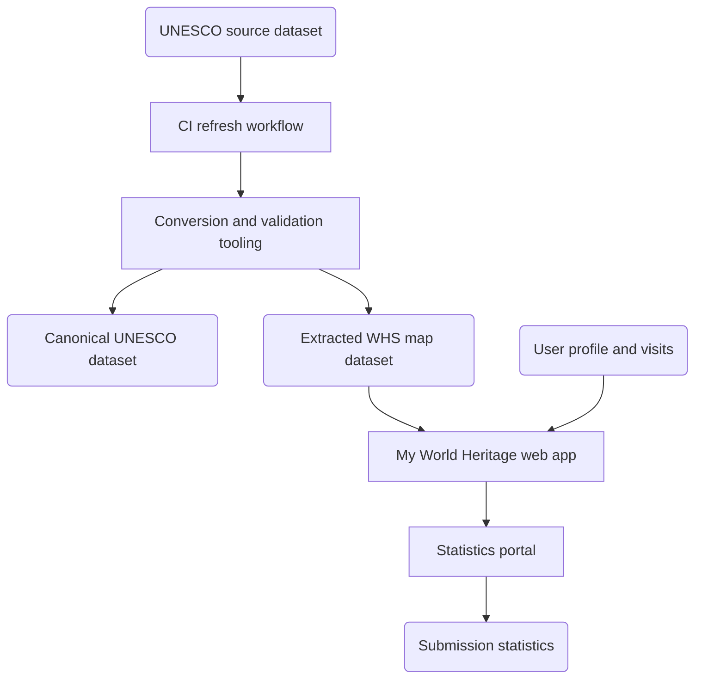

<!-- Requirements.md 0.2.0 -->
# UNESCO World heritage GIS requirements

## Product summary

My World Heritage is a public, user-controlled companion for UNESCO World heritage travel tracking.

The product uses OSM-based mapping, keeps the UNESCO site catalogue current through periodic refresh, keeps personal visit data under user control, avoids paywalls and ad-driven lock-in, and preserves retired sites by marking status rather than deleting records.

The product supports long-term personal use through profile export/import for archive and migration between machines, plus a static visited-sites report export.

A separate pseudonymous usage-summary path tracks adoption and broad usage interest without collecting personally identifiable information.

## Overarching goal

Provide a practical, transparent World heritage companion that maintains currency of official site data while preserving user privacy by default.

## Architecture

Figure 1 shows runtime and data flow. Process components are rectangles and data artifacts are rounded nodes.

Figure 1. My World Heritage data and application architecture.

## Functional requirements

### Dataset currency and quality

The dataset pipeline must keep a stable, auditable, periodically refreshed catalogue with clear provenance:
- Maintain canonical UNESCO official site dataset with periodic automated refresh.
- Split refresh into staged source load and local conversion so conversion always operates on a local file copy.
- Maintain extracted one-record-per-root-WHS output for map consumption.
- Use canonical root site identifiers in `WHS <id>` form in converted datasets.
- Maintain generated component-level synthetic sites in `MWH <WHS id>-<nnn>` form for UNESCO multi-location properties while preserving original WHS entries unchanged.
- Do not generate synthetic component sites when only one component point exists.
- Preserve retired or delisted sites with explicit `status`.
- Keep stable `current` filenames and retain timestamped previous versions in history storage.
- Validate extracted WHS output before publication.
- Include extract-status metadata in canonical JSON with source, counts, sizes, most recent data timestamp, most recent attempt timestamp, and retry interval.
- Send owner alert email when refresh, conversion, or validation fails.

The site-name dictionary remains in scope because it improves readability and is measurable via coverage:
- Maintain curated local-name mapping in `data/mappings/local_name_table.json`, keyed by WHS id with `english_name` and curated `local_name`.
- Inject mapped local names into published canonical JSON and GeoJSON during conversion.
- Maintain coverage report `data/mappings/local_name_coverage.json` for mapped fraction of WHS roots.
- Maintain jurisdiction language policy in `data/mappings/jurisdiction_language_policy.json` with capped language-script selectors.
- Maintain anomaly report `data/mappings/jurisdiction_language_policy_anomalies.json` for review of over-cap language sets.
- Keep selector-cap default at 4.
- Run a separate update exercise for dictionary enrichment from UNESCO/public references, with optional Wikipedia fallback and strict confidence gating before apply.

### Mapping and interaction

The map experience must stay responsive and predictable while supporting both root WHS and component-level recording:
- Show UNESCO sites from local dataset with stable identifiers.
- Show both root WHS entries and component synthetic entries, and allow grouped or per-location recording.
- Group high-volume component entries into `Multiple sites` mode using configurable threshold.
- Exclude high-volume component entries from default `All sites` list to reduce clutter.
- Hide high-volume component markers by default, and reveal them when visited, searched, or selected.
- Show site detail on selection and hide detail when no site is selected.
- Clear current selection when map background is selected.
- Link site title to UNESCO narrative page.
- Show criteria as linked tokens with tooltips.
- Show site name on hover tooltip.
- Use component name as the primary display for synthetic component records.
- Use curated local-name values as supplementary native-script text in tooltip and detail.
- Keep visit status constrained to `not visited`, `visited`, `pending`, `won't visit`.
- Render visited sites in a distinct style.
- Toggle visited and not visited by double-clicking a site marker.
- Support per-site visit log entries with date, status, and note.
- Derive current site status from the most recent visit-log entry for that site.
- Record component visits separately from root WHS visits by site identifier.
- Support create, edit, and delete for multiple visit entries per site.
- Indicate in root WHS detail when the site has multiple component locations.
- Keep site-list columns sortable and keep header visible while scrolling.
- Include blank list mode to hide the right-side list without changing selection context.
- Fit initial load to WHS bounds, then restore saved viewport on later sessions.
- Show WHS identifier only in detail pane in de-emphasised form.
- Support snapshot image capture.
- Support static HTML summary export containing world map and visited-sites table.
- Show loading indicator during data load and long-running actions.

### Search

Search must support site and place lookup with explicit user action:
- Support WHS search by id or name.
- Support geographic place search via geocoding.
- Run search on explicit action (search button or Enter), not on every keystroke.
- Show selectable search results.
- Recenter map on single WHS match.
- Support home-location search with selectable canonical place names.
- Update right-side list on search execution.
- Update right-side list when list mode changes.
- Fall back to local WHS metadata text match when geocoding is unavailable.
- If direct WHS text match is empty but geocoding resolves a region, list sites in resolved bounds.

### Profile and settings lifecycle

Profiles are local-first and portable:
- Keep enrolment separate from Settings.
- Use local profile only, with no required backend dependency.
- Include profile schema version and verify on load/import.
- Support export/import for migration between machines.
- Include visit-log data in export/import payload.
- Use `.profile` as the user-facing import/export extension.
- Disconnect current page session from profile on logout.
- Support silent reconnect from local storage on next load.

Settings are one-line controls and include:
- User name.
- Home location search, selection, and `Use my location`.
- `Visited only` filter.
- Date display format selector (`y-m-d`, `d-m-y`, `m-d-y`) while stored entry values remain canonical.
- Length units selector (`kilometres` or `miles`).
- Multiple-sites threshold.
- `Opt in to periodic usage summary` checkbox.
- Usage-summary info bubble triggered by the `(i)` control.
- Reminder interval numeric input (`days`) with `None` checkbox override.
- Optional usage-summary endpoint URL.
- Optional usage-summary token.
- Last-submission status line.

### Usage and adoption tracking

Usage telemetry is optional, pseudonymous, and aggregate-only:
- Request startup consent once per profile for periodic pseudonymous summary prompts.
- Use default reminder interval of 7 days; allow user-defined interval or none.
- Support endpoint submission without requiring user GitHub account.
- Submit summary with date, use count since last summary, visited site count, and dataset magic cookie.
- Keep clipboard/manual fallback when endpoint submission is unavailable.
- Provide backend encouragement message with active users and average visited sites.
- Record coarse per-load census counters without detailed behavioural telemetry.
- Treat counts as approximate due to abandoned sessions, multi-device use, and repeated use.
- Keep nearby-site distance display locale-sensitive and configurable (pending strategy finalisation).

## Data formats and storage

Table 1. Data artifacts and file types.

| Artifact | Format | Purpose | Location |
| --- | --- | --- | --- |
| Canonical UNESCO dataset | `.json` | Authoritative project dataset | `data/current/unesco_official_sites.json` |
| WHS map dataset | `.geojson` | Map-layer consumption by SPA | `data/current/unesco_official_sites.geojson` |
| User profile export/import | `.profile` (JSON payload) | Archive and machine transfer of user data | User-managed files |
| Dataset history snapshots | `.json` and `.geojson` | Audit and rollback history | `data/history/` |
| Usage-summary payload contract | `.json` schema | Backend payload contract | `backend/usage_summary_backend/usage_summary.schema.json` |

Storage behaviour is:
- User profile, visits, and usage counters are stored in browser `localStorage`.
- Logout state is in-memory for the active page session.
- Personal/private artifacts must remain excluded from commits.

## Source, licensing, and OSM support

Source and licensing requirements are:
- UNESCO pages are authoritative for official listing and narrative references.
- OSM and Wikidata may provide geometry and linkage.
- Report map tile provider attribution must be included in documentation and exported artifacts where required.
- Narrative text is linked, not republished wholesale, unless licensing permits.
- Attribution must be present for all data sources.

OSM support requirements are:
- Provide tooling/docs to identify missing or ambiguous OSM linkage (`ref:whc`).
- Generate review lists to support optional human OSM improvements.

## Publication requirements

Publication requirements are:
- Publish artifacts and documentation via GitHub and GitHub Pages.
- Use the custom My World Heritage viewer as the primary operational application.
- Enable users to keep private data private and optionally share selected fragments.
- Provide reproducible local workflow for refresh, extraction, and validation.

## Application design and components

The application is a static single-page web app with local-first profile state and optional statistics submission.

Table 2. Application components and imported services.

| Component | Type | Purpose | Runtime role |
| --- | --- | --- | --- |
| `site/index.html` | SPA entry file | Main application shell and behaviour | Primary user interface |
| Leaflet (`leaflet.css`, `leaflet.js`) | External library | Map rendering and interaction | Core map engine |
| OpenStreetMap tiles | External data service | Basemap imagery | Map background tiles |
| ArcGIS World Physical Map tiles | External data service | Summary report world-map tile source | Report-map rendering path |
| Nominatim | External data service | Place geocoding for search/home location | Geographic search provider |
| `html2canvas` | External library | Snapshot/report rendering support | Client-side capture helper |
| Google Apps Script endpoint | External application | Usage-summary ingest and aggregate stats | Statistics portal |
| GitHub Pages | Hosting platform | Public static site delivery | Production hosting |
| UNESCO dataset artifacts | Repository data | Current and historical WHS records | Application data source |

## Site specification

Table 3. User interface elements and purpose.

| User interface element | Purpose |
| --- | --- |
| Brand mark button | Shows tooltip clarifying the symbol is custom and not UNESCO, World Heritage Emblem, or Hague Blue Shield. |
| Application title button | Opens help and dataset-status dialog. |
| Search control | Executes explicit site/place search and updates results. |
| Search results list | Selects matched site or place result. |
| Snapshot button | Captures and copies/downloads current map image. |
| Site list mode selector | Switches list mode (`All`, `Multiple`, `Visited`, `Searched`, blank). |
| Loading indicator | Signals active load and long-running actions. |
| Usage summary inbox icon | Appears when periodic summary is due. |
| User menu | Opens settings, export, import, summary, submit, reset, and logout actions. |
| Site list pane | Displays current list-mode results with sortable columns. |
| Site detail pane | Displays selected site metadata and visit-log controls. |
| Visit log editor | Adds, edits, and deletes dated visit entries. |
| Enrolment dialog | First-run setup for user identity and home location. |
| Settings dialog | Edits profile, filters, formatting, thresholds, and submission settings. |
| Usage summary dialog | Shows payload, submit state, and backend response. |

Key interaction behaviour is:
- Search executes only on explicit action (magnifier or Enter).
- Site and date columns in lists are sortable and remain aligned on narrow screens.
- Date entry accepts `YYYY`, `YYYY-MM`, or `YYYY-MM-DD` canonical forms.
- Summary export creates a static HTML report suitable for archival and sharing.
- Export/import uses `.profile` extension for user-facing portability.

### Summary report export

The exported Summary report is a self-contained HTML artifact designed for sharing and archival:
- Report title format is `My World Heritage - <User>`.
- Header includes generated local timestamp, visited-site count, and `Prepared with My World Heritage` link plus URL.
- Report includes a world-map image with visited-site markers.
- Report table columns are `Site`, `Name`, `Visited`, `Status`, and `Country`.
- `Site` uses the application identifier (`WHS` root id or `MWH` component id).
- `Name` links to UNESCO narrative URL when available.
- Report ends with a column guide describing each table field.

## Backend script specification

The Apps Script backend at `backend/usage_summary_backend/google_apps_script/Code.gs` supports ingest, aggregate statistics, and digest support.

Public web-callable interfaces are only `doGet` and `doPost`. Self-test and helper functions are callable from Apps Script editor/runtime context, not from public web requests.

Table 4. Backend interfaces and invocation context.

| Interface | Web callable | Purpose |
| --- | --- | --- |
| `doGet` | Yes | Health and aggregate stats response (`?stats=1`). |
| `doPost` | Yes | Validate payload and append usage summary row. |
| `buildRecentStats_` | No | Compute active users and average visited sites. |
| `sendPeriodicDigest` | No | Send owner digest email from workbook rows. |
| `backendSelfTestDryRun` | No | Validate workbook and token wiring without row insert. |
| `backendSelfTestAppend` | No | Insert controlled backend self-test row. |
| `installDailyDigestTrigger` | No | Create daily digest trigger. |
| `enforceWorkbookBinding_` | No | Restrict writes to configured workbook id/name. |

Table 5. Backend settings guidance.

| Setting | Default | Recommended | Range | Description |
| --- | --- | --- | --- | --- |
| `MWH_ALLOWED_SPREADSHEET_ID` | none | required | exact id | Bound workbook id allow-list. |
| `MWH_ALLOWED_SPREADSHEET_NAME` | empty | set in production | exact name or empty | Optional strict workbook name check. |
| `MWH_INGEST_TOKEN` | empty | set for shared/public endpoint | non-empty string or empty | Optional shared token gate for ingest. |
| `MWH_REPORT_EMAIL` | none | required for digest | valid email | Digest recipient address. |
| `MWH_REPORT_DAYS` | `7` | `7` or `14` | integer >= 1 | Digest lookback window in days. |
| `MWH_STATS_WINDOW_DAYS` | `14` | about `2 x MWH_REPORT_DAYS` | integer >= 1 | Encouragement/aggregate stats window. |
| `MWH_MIN_INTERVAL_SECONDS` | `30` | `30` to `120` | `1` to `3600` | Minimum gap per cookie between accepted submissions. |
| `MWH_MAX_SUBMISSIONS_PER_COOKIE_PER_HOUR` | `12` | `12` production, higher for test | `1` to `1000` | Hourly cap per cookie for burst damping. |
| `MWH_DUPLICATE_TTL_SECONDS` | `3600` | >= min interval | `60` to `86400` | Duplicate suppression window. |
| `MWH_MAX_PAYLOAD_BYTES` | `4096` | `4096` | `512` to `65536` | Payload size guardrail. |
| `MWH_LAST_DIGEST_AT` | script-managed | do not set manually | ISO timestamp | Last digest send marker. |

### Backend settings guidance details

#### `MWH_ALLOWED_SPREADSHEET_ID` and `MWH_ALLOWED_SPREADSHEET_NAME`

Use id binding as a hard requirement. Name binding is optional but recommended in production as an additional guard against accidental re-binding.

#### `MWH_STATS_WINDOW_DAYS` and `MWH_REPORT_DAYS`

Set stats window longer than digest window so user-facing encouragement stays stable while owner digests stay frequent enough for operations.

#### `MWH_MIN_INTERVAL_SECONDS`, `MWH_MAX_SUBMISSIONS_PER_COOKIE_PER_HOUR`, and `MWH_DUPLICATE_TTL_SECONDS`

Treat these as coordinated controls: minimum interval limits immediate repeats, hourly cap dampens scripted bursts, and duplicate TTL suppresses near-identical replays.

## History (retired paths)

Legacy interoperability and bootstrap approaches are retired from active product intent and runtime architecture.

Historical artifacts may remain in `archive/` for traceability only. They are not part of live data load paths or current CI update paths.

## Designs considered but not selected

The following decisions are retained for traceability:
- Manual per-site status as primary source of truth; replaced by visit-log-first model where status is derived from visits.
- Search-on-typing as primary interaction; replaced by explicit search trigger for predictable updates.
- Detailed usage-summary payload with extended behavioural metrics; replaced by minimal adoption-focused payload.

## Non-goals and deferred items

The following items are intentionally deferred or excluded:
- Advertising support.
- Mandatory-auth hosted platform for public core dataset.
- Public social review features.
- Full transport-network route reconstruction.
- Locale-sensitive nearby-distance presentation strategy.
- Direct automated push of usage summaries to GitHub without explicit user action.
- Manual local-file import fallback for UNESCO extract refresh.
- Comprehensive location support.

## Product backlog

The following backlog items capture material extensions discussed but not yet implemented:

| Backlog item | Current state | Treatment |
| --- | --- | --- |
| Travel sequence lines (straight or great-circle) | Not implemented | Add local-only travel-segment layer and report rendering support. |
| Interface localisation setting and bundles | Partially designed | Implement i18n bundle loading and runtime language switch in SPA. |
| Local-name update source hardening | Partially implemented | Remove Overpass-cache dependency from local-name update scripts and use UNESCO/public-reference plus curated mapping workflow only. |
| Version coherence automation | Manual | Add CI check to enforce version consistency across app, README, test plan, and release notes. |
| Report map source policy | Mixed sources | Define one explicit basemap policy for interactive map and summary report, including attribution language in docs. |

## Localisation requirements and implementation notes (pending)

Localisation remains a pending extension.

The pending requirements are:
- Add interface-language setting in Settings.
- Keep canonical dataset keys unchanged while localising interface text and formatting.
- Use curated local-script site labels as supplementary display where available.
- Preserve canonical stored visit-date values while localising display format.

A practical implementation path is:
- Add `site/i18n/en.json` baseline bundle and one additional bundle.
- Add runtime helpers `t(key, params)` and `setLanguage(langCode)` with profile persistence.
- Move UI labels, messages, and tooltips into bundles in staged passes.
- Use `Intl.DateTimeFormat` and `Intl.NumberFormat` for display formatting.
- Validate no regression in search, visits, export/import, and usage-summary submission.

## Acceptance criteria

Release readiness requires:
- Reproducible and reliable data refresh pipeline.
- Stable WHS layer load with deterministic identifiers.
- Personal data not committed by default.
- Working profile lifecycle without mandatory backend dependency.
- Synchronised requirements and implemented feature set.
