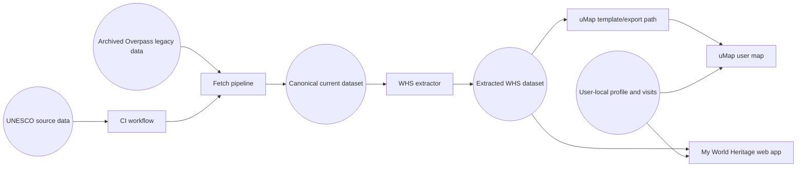

<!-- Requirements.md 0.1.4 -->
# UNESCO World heritage GIS requirements

## Product intent

Build a public, reusable UNESCO World heritage dataset and viewer workflow that:

- keeps map hosting on OSM infrastructure with optional uMap interoperability,
- keeps personal visit/travel data under user control,
- avoids paywalls/ad-driven lock-in,
- preserves retired sites rather than deleting them.

## Overarching goal

Provide a practical, user-controlled World heritage companion that keeps UNESCO site data current and transparent, while keeping personal visit data private by default.

## Architecture

## Functional requirements

### Dataset and update

- Maintain canonical UNESCO official site dataset with periodic automated refresh.
- Split refresh into staged source load and local conversion steps so conversion always operates on a local file copy.
- Maintain extracted one-record-per-root-WHS dataset for map consumption.
- Maintain generated component-level synthetic sites (`MWH <WHS id>-<nnn>`) for UNESCO multi-location properties while preserving original UNESCO WHS entries unchanged.
- Do not generate synthetic component sites when only one component point exists; keep that case on the root WHS record only.
- Preserve retired/delisted sites with explicit `status`.
- Keep historical snapshots and auditable diffs.
- Keep stable `current` dataset filenames and retain timestamped previous versions in a history store.
- Validate extracted WHS dataset before publication.
- Treat prior Overpass-derived dataset as historical archive only; do not wire it into live application data loading.
- Include extract-status metadata and a note fragment in canonical JSON showing source, count, sizes, most recent data timestamp, most recent attempt timestamp, and retry interval.
- Maintain a reusable local-name mapping table (`data/mappings/local_name_table.json`) keyed by WHS id with `english_name` and curated `local_name`.
- Inject mapped local-name values into published canonical JSON/GeoJSON during every extract conversion.
- Maintain a coverage report (`data/mappings/local_name_coverage.json`) showing proportion of WHS roots with mapped local names.
- Maintain a jurisdiction language policy table (`data/mappings/jurisdiction_language_policy.json`) keyed by jurisdiction ISO code with capped language-script selectors.
- Maintain a jurisdiction-language anomaly report (`data/mappings/jurisdiction_language_policy_anomalies.json`) for review of over-cap official-language sets.
- Include input-source fingerprints in jurisdiction policy outputs so deterministic runs can be verified for fixed inputs.
- Use default jurisdiction selector cap of 4 (not 3), based on observed material losses at cap 3 (including Switzerland and Fiji official-selector coverage).
- Provide a separate update exercise/script that proposes mapping-table updates from UNESCO/Overpass sources, with optional Wikipedia fallback and strict confidence gating before apply.
- Provide an on-demand CI workflow for local-name maintenance that runs the update/coverage scripts and can optionally apply only high-confidence mapping updates.

### Mapping and interaction

- Show UNESCO sites from local dataset with stable identifiers.
- Show both root WHS entries and component synthetic entries, and allow users to use either grouped (root) or per-location (component) recording.
- Group high-volume component synthetic entries into a dedicated `Multiple sites` list mode using a configurable threshold.
- Exclude high-volume component synthetic entries from the default `All sites` list so they do not dominate standard browsing.
- Hide high-volume component markers by default on map redraw, and reveal them when visited, searched, or explicitly selected.
- Show site detail on selection; hide detail when nothing is selected.
- Clicking map background clears current selection.
- Site title links to UNESCO page for narrative text.
- Criteria are shown as linked tokens with tooltips.
- Hover tooltip shows site name.
- For synthetic component sites, use the component/sub-site name as the primary display name (avoid repeating the root-site summary in the title).
- Use curated local-name mapping values as supplementary native-script text in tooltip/detail.
- Do not auto-display UNESCO translation columns as local-script names unless they are explicitly curated into the mapping table.
- Visit status is constrained to: not visited, visited, pending, won't visit.
- Visited sites render in distinct colour from non-visited sites.
- Double-click on a site toggles visited and not visited.
- Site detail supports a per-site visit log with date, status, and note entries.
- Component visits and root WHS visits are recorded separately by site identifier.
- Users can create, edit, and delete multiple dated visit entries for the same site.
- Root WHS detail indicates when the WHS contains multiple individual component sites.
- Site list presents `Site` and `Visited` columns with header-driven sorting.
- Site-list mode includes an explicit blank/no-list option so users can hide the list pane without changing selection state.
- Site tooltip supports multiline display for long component names, with a clear component separator glyph.
- Initial load fits WHS bounds; subsequent loads restore prior viewport.
- Site identifier (WHS id) is shown only in the detail pane in de-emphasised form.
- Snapshot action captures a map image for sharing (clipboard image copy when supported, otherwise file download).
- Show a visible loading indicator during data load and other long-running user actions.

### Search

- Unified search supports both:
- WHS site search by id/name.
- Geographic place search via geocoding.
- Search renders selectable result list entries.
- Search runs on explicit user request from search control.
- Home-location search presents selectable list results with canonical place naming.
- Search updates the right-side site list immediately when requested.
- Changing site-list mode immediately refreshes the right-side list.
- If web geocoding is unavailable, local WHS metadata text matching still returns site results.
- If WHS direct text matching is empty but geocoding resolves a region, sites in the resolved bounding box are listed.

### Profile and session

- First-run enrolment is distinct from Settings and initializes user identity/home location.
- Use local profile only (no backend dependency).
- Include schema version in profile and verify on load/import.
- Include import/export for migration between systems.
- Include visit-log data in import/export payloads.
- Support import mapping from legacy personal-layer data carrying `date`, `note`, `status`, and `ref_whc`.
- Logout disconnects current page session from local profile.
- Connect performs current silent reconnect from local store.

### Settings

- Settings includes:
- user name,
- home location search + select + use-my-location,
- separate from enrolment flow,
- visited-only filter,
- usage-summary reminder controls (`interval days` or `none`).
- date display format selector (`y-m-d`, `d-m-y`, `m-d-y`) while stored entry values remain `YYYY-MM-DD` or `YYYY-MM`,
- length units selector (`kilometres` or `miles`).
- multiple-sites threshold setting (default `5`) controlling when component entries move into `Multiple sites`.
- Home location search uses selectable list (combo-style), not button-per-result.
- If one canonical match is selected, subsequent search confirms that selection.

### Usage summary and census (pending integration)

- Request startup consent for periodic pseudonymised summary prompt.
- Default reminder interval: 7 days; user can change interval or set none.
- Allow submission without requiring each user to have a GitHub account.
- Summary includes:
- date,
- use count since last summary publication,
- total site count in catalogue,
- dataset magic cookie.
- Support an optional anonymous form/endpoint URL in Settings for direct summary submission.
- Keep clipboard/manual fallback when endpoint submission is unavailable.
- Provide a periodic owner digest email path from collected summaries.
- Record coarse per-load census counter without detailed telemetry.
- Note that counts are approximate due to abandoned sessions, multi-device use, and repeated use.
- Distance display in nearby-site suggestions is deferred until locale-sensitive formatting/unit strategy is defined.

## Data storage requirements

- Site catalog data is stored in a canonical repository JSON file, with GeoJSON generated as a derived map-consumption artifact.
- User profile and usage counters are stored in browser localStorage.
- Logout state is in-memory for the current page only; no separate browser session-storage key is used.
- Personal/private artifacts must remain excluded from commits.

## Source and licensing requirements

- UNESCO pages are authoritative for official listing/narrative references.
- OSM/Wikidata may provide geometry/linkage.
- Narrative text should be linked, not republished wholesale, unless license permits.
- Attribution must be present for all data sources.

## OSM support requirements

- Provide tooling/docs to identify missing or ambiguous OSM linkage (`ref:whc`).
- Generate review lists to support optional human OSM improvements.

## Publication requirements

- Publish artifacts and docs via GitHub/GitHub Pages.
- Use the custom My World Heritage viewer as the primary operational application.
- Keep uMap as an optional seed/export interoperability path, not the primary runtime.
- Enable users to keep private data privately and optionally share selected fragments.
- Provide a reproducible local workflow for refresh, extraction, validation, and optional uMap template interoperability.

## Designs considered but not selected

- Legacy Overpass-derived WHS ingestion as live source:
- reason not selected: region-partitioned live Overpass queries were operationally fragile and caused incomplete or delayed map loads.
- reason not selected: partitioning introduced overlap/gap risk and required manual tuning of region boundaries.
- reason not selected: coverage and authority were insufficient for canonical UNESCO maintenance.
- selected replacement: UNESCO official-source ingestion with deterministic local conversion and validation.
- historical note: only the packaged legacy snapshot and scripts are retained in `archive/overpass_legacy/` for traceability.
- Manual per-site status as primary source of truth:
- reason not selected: superseded by visit-log-first model where status is derived from recorded visits.
- Search-on-typing as primary interaction:
- reason not selected: replaced with explicit search-trigger behaviour for predictable updates.
- Detailed usage-summary payload (visited/inspected counts and duration):
- reason not selected: replaced by minimal usage-interest summary (`use count since last push`, `total site count`, date, magic cookie).

## Non-goals and deferred items

- Advertising support.
- Mandatory-auth hosted platform for public core dataset.
- Public social review features.
- Full transport-network route reconstruction.
- Locale-sensitive distance display strategy for nearby-site labels.
- Direct automated push of usage summaries to GitHub without explicit user action.
- UNESCO official-list scraper integration replacing Overpass bootstrap source (pending legal/licensing/format review).
- Manual local-file import fallback for UNESCO extract refresh.
- Comprehensive locationation support.

## Acceptance criteria

- Data refresh pipeline remains reproducible and reliable.
- WHS layer loads without frequent remote runtime failures.
- Personal data is not committed by default.
- Settings and profile lifecycle functions work without backend support.
- Requirements stay synchronized with implemented feature set.

