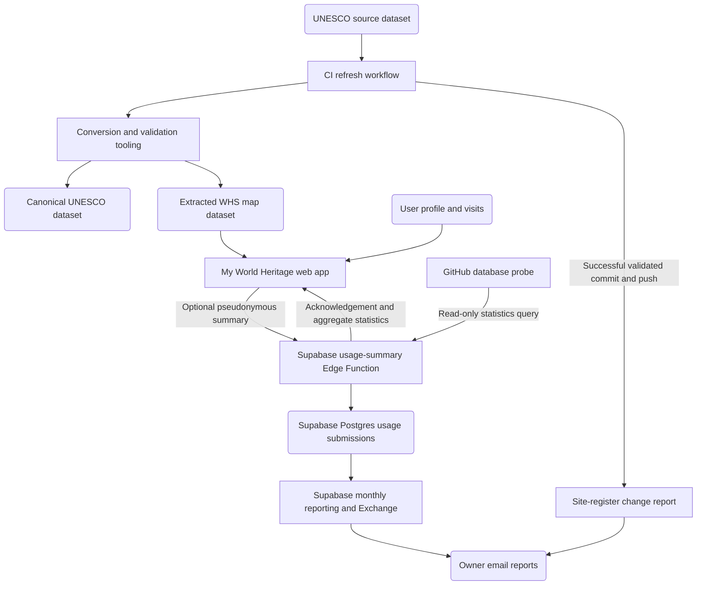

<!-- Requirements.md 0.2.0 -->
# UNESCO World heritage GIS requirements

## Product summary

My World Heritage is a public, user-controlled companion for UNESCO World heritage travel tracking.

The product uses OSM-based mapping, keeps the UNESCO site catalogue current through periodic refresh, keeps personal visit data under user control, avoids paywalls and ad-driven lock-in, and preserves retired sites by marking status rather than deleting records.

The product supports long-term personal use through profile export/import for archive and migration between machines, plus a static visited-sites report export.

A separate Supabase monitoring platform records pseudonymous usage summaries and provides aggregate adoption statistics. GitHub Actions monitors database availability and sends owner reports for user activity and site-register changes. Profiles, visit details and the site catalogue do not move into Supabase.

## Overarching goal

Provide a practical, transparent World heritage companion that maintains currency of official site data while preserving user privacy by default.

## Architecture

Project origin and baseline architecture:
- Project start date: 2025-12-21 (from the initial `OpenStreetMap vibe coding` kickoff message).
- Initial mapping architecture baseline: hosted uMap prototype on the OpenStreetMap uMap platform.

Figure 1 shows the target runtime and data flow. Process components are rectangles and data artifacts are rounded nodes. Deployment status is recorded in the monitoring-platform specification below.

```mermaid
flowchart TD
  A1(UNESCO source dataset)
  A2(Canonical UNESCO dataset)
  A3(Extracted WHS map dataset)
  A4(User profile and visits)
  A5(Supabase Postgres usage submissions)
  A6(Owner email reports)

  P1[CI refresh workflow]
  P2[Conversion and validation tooling]
  P3[My World Heritage web app]
  P4[Supabase usage-summary Edge Function]
  P5[GitHub database probe]
  P6[Supabase monthly reporting and Exchange]
  P7[Site-register change report]

  A1 --> P1
  P1 --> P2
  P2 --> A2
  P2 --> A3
  A3 --> P3
  A4 --> P3
  P3 -->|Optional pseudonymous summary| P4
  P4 --> A5
  P4 -->|Acknowledgement and aggregate statistics| P3
  P5 -->|Read-only statistics query| P4
  A5 --> P6
  P6 --> A6
  P1 -->|Successful validated commit and push| P7
  P7 --> A6
```

Figure 1. My World Heritage data and application architecture.

## Functional requirements

### Dataset currency and quality

The dataset pipeline must keep a stable, auditable, periodically refreshed catalogue with clear provenance:
- Maintain canonical UNESCO official site dataset with periodic automated refresh.
- Split refresh into staged source load and local conversion so conversion always operates on a local file copy.
- Maintain extracted one-record-per-root-WHS output for map consumption.
- Use canonical root site identifiers in `WHS <id>` form in converted datasets.
- Maintain generated component-level synthetic sites in `MWH <WHS id>-<nnn>` form for UNESCO multi-location properties while preserving original WHS entries unchanged.
- Do not generate synthetic component sites when only one component point exists.
- Preserve known sites and components with `status` of `active` or `retired`. Retired means absent from the latest source, not independently confirmed UNESCO delisting. Preserve visit identifiers; reappearance reactivates the same entry.
- Keep stable `current` filenames and use Git history plus annotated ingestion tags for forensic history. Do not generate duplicate timestamped snapshots or build a temporal catalogue.
- Validate extracted WHS output before publication.
- Include extract-status metadata in canonical JSON with source, counts, sizes, most recent data timestamp, most recent attempt timestamp, and retry interval.
- Send owner alert email when refresh, conversion, or validation fails.
- Email the owner a separate site-register change report after each successful refresh commit and push, distinguishing added, retired, reactivated, changed and unexpectedly removed records. Ignore formatting and generation metadata; include root/component counts and a complete downloadable change list.

The site-name dictionary remains in scope because it improves readability and is measurable via coverage:
- Maintain curated local-name mapping in `data/mappings/local_name_table.json`, keyed by WHS id with `english_name` and curated `local_name`.
- Inject mapped local names into published canonical JSON and GeoJSON during conversion.
- Maintain coverage report `data/mappings/local_name_coverage.json` for mapped fraction of WHS roots.
- Maintain jurisdiction language policy in `data/mappings/jurisdiction_language_policy.json` with capped language-script selectors.
- Maintain anomaly report `data/mappings/jurisdiction_language_policy_anomalies.json` for review of over-cap language sets.
- Keep selector-cap default at 4.
- Run a separate update exercise for dictionary enrichment from UNESCO/public references, with optional Wikipedia fallback and strict confidence gating before apply.

### Mapping and interaction

The map experience must stay responsive and predictable while supporting both root WHS and component-level recording:
- Show UNESCO sites from local dataset with stable identifiers.
- Show both root WHS entries and component synthetic entries, and allow grouped or per-location recording.
- Group high-volume component entries into `Multiple sites` mode using configurable threshold.
- Exclude high-volume component entries from default `All sites` list to reduce clutter.
- Hide high-volume component markers by default, and reveal them when visited, searched, or selected.
- Show site detail on selection and hide detail when no site is selected.
- Clear current selection when map background is selected.
- Link site title to UNESCO narrative page.
- Show criteria as linked tokens with tooltips.
- Show site name on hover tooltip.
- Use component name as the primary display for synthetic component records.
- Use curated local-name values as supplementary native-script text in tooltip and detail.
- Keep visit status constrained to `not visited`, `visited`, `pending`, `won't visit`.
- Render visited sites in a distinct style.
- Toggle visited and not visited by double-clicking a site marker.
- Support per-site visit log entries with date, status, and note.
- Derive current site status from the most recent visit-log entry for that site.
- Record component visits separately from root WHS visits by site identifier.
- Support create, edit, and delete for multiple visit entries per site.
- Indicate in root WHS detail when the site has multiple component locations.
- Keep site-list columns sortable and keep header visible while scrolling.
- Include blank list mode to hide the right-side list without changing selection context.
- Fit initial load to WHS bounds, then restore saved viewport on later sessions.
- Show WHS identifier only in detail pane in de-emphasised form.
- Support snapshot image capture.
- Support static HTML summary export containing world map and visited-sites table.
- Show loading indicator during data load and long-running actions.

### Search

Search must support site and place lookup with explicit user action:
- Support WHS search by id or name.
- Support geographic place search via geocoding.
- Run search on explicit action (search button or Enter), not on every keystroke.
- Show selectable search results.
- Recenter map on single WHS match.
- Support home-location search with selectable canonical place names.
- Update right-side list on search execution.
- Update right-side list when list mode changes.
- Fall back to local WHS metadata text match when geocoding is unavailable.
- If direct WHS text match is empty but geocoding resolves a region, list sites in resolved bounds.

### Profile and settings lifecycle

Profiles are local-first and portable:
- Keep enrolment separate from Settings.
- Use local profile only, with no required backend dependency.
- Include profile schema version and verify on load/import.
- Support export/import for migration between machines.
- Include visit-log data in export/import payload.
- Use `.profile` as the user-facing import/export extension.
- Disconnect current page session from profile on logout.
- Support silent reconnect from local storage on next load.

Settings are one-line controls and include:
- User name.
- Home location search, selection, and `Use my location`.
- `Visited only` filter.
- Date display format selector (`y-m-d`, `d-m-y`, `m-d-y`) while stored entry values remain canonical.
- Length units selector (`kilometres` or `miles`).
- Multiple-sites threshold.
- Selecting a site temporarily reveals its marker during zoom even when the visited-only filter is enabled. The next normal marker redraw reapplies the filter.
- `Opt in to periodic usage summary` checkbox.
- Usage-summary info bubble triggered by the `(i)` control.
- Reminder interval numeric input (`days`) with `None` checkbox override.
- Optional usage-summary endpoint URL.
- Optional usage-summary token.
- Last-submission status line.

### Usage and adoption tracking

Usage telemetry is optional, pseudonymous, and aggregate-only:
- Request startup consent once per profile for periodic pseudonymous summary prompts.
- Use default reminder interval of 7 days; allow user-defined interval or none.
- Support endpoint submission without requiring user GitHub account.
- Submit summary with date, use count since last summary, visited site count, and dataset magic cookie.
- Keep clipboard/manual fallback when endpoint submission is unavailable.
- Provide backend encouragement message with active users and average visited sites.
- Record coarse per-load census counters without detailed behavioural telemetry.
- Treat counts as approximate due to abandoned sessions, multi-device use, and repeated use.
- Keep nearby-site distance display locale-sensitive and configurable (pending strategy finalisation).
- Use Supabase as the replacement for Google Apps Script/Sheets submission storage; no Supabase account is required for app users.
- Reuse the same submission identifier and payload on retry. A duplicate accepted submission must acknowledge the existing row without creating another.
- Advance publication counters only after a valid acceptance acknowledgement, and only to the usage total captured in that submission. Clipboard copies, unverified dispatch and failures do not count as accepted submissions.
- Send the existing profile User name as `name` in monitoring submissions and initial owner notifications. Do not introduce a separate reporting alias. Exclude home locations, individual visits, visit notes, browser user-agent strings and submission tokens from monitoring storage.

## Data formats and storage

Table 1. Data artifacts and file types.

| Artifact | Format | Purpose | Location |
| --- | --- | --- | --- |
| Canonical UNESCO dataset | `.json` | Authoritative project dataset | `data/current/unesco_official_sites.json` |
| WHS map dataset | `.geojson` | Map-layer consumption by SPA | `data/current/unesco_official_sites.geojson` |
| User profile export/import | `.profile` (JSON payload) | Archive and machine transfer of user data | User-managed files |
| Dataset history | Git commits and annotated tags | Audit and rollback of source and current outputs | `unesco-ingest/*` tags; `data/provenance/ingestion-history.json` inventories older commits |
| Usage-summary payload contract | `.json` schema | Backend payload contract | `backend/usage_summary_backend/usage_summary.schema.json` |
| Accepted usage submissions | PostgreSQL rows | Pseudonymous adoption records and aggregate reporting | Supabase `public.usage_submissions` |
| Site-register change report | Text and JSON workflow artifacts | Owner notification and complete change list | Successful refresh run; 90-day artifact retention, with permanent evidence in Git |

Storage behaviour is:
- User profile, visits, and usage counters are stored in browser `localStorage`.
- Logout state is in-memory for the active page session.
- Personal/private artifacts must remain excluded from commits.
- Supabase tables and SQL functions must deny direct access by anonymous and ordinary authenticated app clients. The server-side service role handles approved database operations.

## Source, licensing, and OSM support

Source and licensing requirements are:
- UNESCO pages are authoritative for official listing and narrative references.
- OSM and Wikidata may provide geometry and linkage.
- Report map tile provider attribution must be included in documentation and exported artifacts where required.
- Narrative text is linked, not republished wholesale, unless licensing permits.
- Attribution must be present for all data sources.

OSM support requirements are:
- Provide tooling/docs to identify missing or ambiguous OSM linkage (`ref:whc`).
- Generate review lists to support optional human OSM improvements.

## Publication requirements

Publication requirements are:
- Publish artifacts and documentation via GitHub and GitHub Pages.
- Use the custom My World Heritage viewer as the primary operational application.
- Enable users to keep private data private and optionally share selected fragments.
- Provide reproducible local workflow for refresh, extraction, and validation.

## Application design and components

The application is a static single-page web app with local-first profile state and optional statistics submission.

Table 2. Application components and imported services.

| Component | Type | Purpose | Runtime role |
| --- | --- | --- | --- |
| `site/index.html` | SPA entry file | Main application shell and behaviour | Primary user interface |
| Leaflet (`leaflet.css`, `leaflet.js`) | External library | Map rendering and interaction | Core map engine |
| OpenStreetMap tiles | External data service | Basemap imagery | Map background tiles |
| ArcGIS World Physical Map tiles | External data service | Summary report world-map tile source | Report-map rendering path |
| Nominatim | External data service | Place geocoding for search/home location | Geographic search provider |
| `html2canvas` | External library | Snapshot/report rendering support | Client-side capture helper |
| Supabase Edge Function and Postgres | Monitoring backend | Usage-summary ingest, durable receipts, aggregate statistics and new-profile alert queue | `supabase/`; deployed, browser test and Exchange acceptance verified; published-site cutover pending |
| GitHub Actions database probe | Availability and activity check | Read-only database query with randomised timing | `.github/workflows/supabase-probe.yml`; live verification passed and schedule enabled |
| Supabase and Exchange 365 | Owner reporting | Monthly user-activity and site-register email | 08:00 Africa/Johannesburg on the first |
| GitHub Pages | Hosting platform | Public static site delivery | Production hosting |
| UNESCO dataset artifacts | Repository data | Current and historical WHS records | Application data source |

## Site specification

Table 3. User interface elements and purpose.

| User interface element | Purpose |
| --- | --- |
| Brand mark button | Shows tooltip clarifying the symbol is custom and not UNESCO, World Heritage Emblem, or Hague Blue Shield. |
| Application title button | Opens help and dataset-status dialog. |
| Search control | Executes explicit site/place search and updates results. |
| Search results list | Selects matched site or place result. |
| Snapshot button | Captures and copies/downloads current map image. |
| Site list mode selector | Switches list mode (`All`, `Multiple`, `Visited`, `Searched`, blank). |
| Loading indicator | Signals active load and long-running actions. |
| Usage summary inbox icon | Appears when periodic summary is due. |
| User menu | Opens settings, export, import, summary, submit, reset, and logout actions. |
| Site list pane | Displays current list-mode results with sortable columns. |
| Site detail pane | Displays selected site metadata and visit-log controls. |
| Visit log editor | Adds, edits, and deletes dated visit entries. |
| Enrolment dialog | First-run setup for user identity and home location. |
| Settings dialog | Edits profile, filters, formatting, thresholds, and submission settings. |
| Usage summary dialog | Shows payload, submit state, and backend response. |

Key interaction behaviour is:
- Search executes only on explicit action (magnifier or Enter).
- Site and date columns in lists are sortable and remain aligned on narrow screens.
- Date entry accepts `YYYY`, `YYYY-MM`, or `YYYY-MM-DD` canonical forms.
- Summary export creates a static HTML report suitable for archival and sharing.
- Export/import uses `.profile` extension for user-facing portability.

### Summary report export

The exported Summary report is a self-contained HTML artifact designed for sharing and archival:
- Report title format is `My World Heritage - <User>`.
- Header includes generated local timestamp, visited-site count, and `Prepared with My World Heritage` link plus URL.
- Report includes a world-map image with visited-site markers.
- Report table columns are `Site`, `Name`, `Visited`, `Status`, and `Country`.
- `Site` uses the application identifier (`WHS` root id or `MWH` component id).
- `Name` links to UNESCO narrative URL when available.
- Report ends with a column guide describing each table field.

## Supabase monitoring platform

### Project and deployment status

The designated project is `fjqhgcegnphavatrchjb`, at `https://fjqhgcegnphavatrchjb.supabase.co`. Its application endpoint is `/functions/v1/usage-summary`.

Last verified on 2 October 2026:

- The owner has created the project.
- The [GitHub probe change](https://github.com/pekka-28/unesco/pull/1) is merged into `main`, and its automated tests pass.
- GitHub secret `SUPABASE_URL` contains the project URL. Repository variable `MWH_SUPABASE_PROBE_ENABLED` is `true`.
- Supabase CLI applied the usage-summary migration and deployed the Edge Function. The allowed origin is `https://pekka-28.github.io`; a further migration dry run found no pending changes.
- Hosted RLS, restricted grants, service-role insertion, duplicate receipts and statistics passed verification; the temporary test row was rolled back.
- The live read-only database probe passed locally and in [GitHub Actions](https://github.com/pekka-28/unesco/actions/runs/36935189208), and scheduled probing is enabled.
- The monthly Exchange delivery check and first-profile alert are confirmed received. The combined monthly report runs through Supabase cron.
- Publish only the canonical `/site/` application, with Supabase reporting. The retired `/site-supabase/` entry redirects here without changing browser identity or visit history.
- The new-profile queue, immediate background dispatch and Supabase retry worker are deployed. The owner confirmed an interactive Exchange 365 test email. Exchange accepted the unattended Supabase delivery test and browser-triggered new-profile alert on 2 October 2026; the owner confirmed inbox receipt of both messages. The isolated browser test verified adoption, a manual visit-count update and profile persistence against live Supabase. It used local site files at the permitted Pages origin; the Supabase-only cutover adds automatic settings migration.

Deployment and credential setup are documented in [supabase/DEPLOYMENT.txt](supabase/DEPLOYMENT.txt). This status records the last verification, not continuous monitoring of the live configuration.

### Submission and statistics interfaces

The implementation consists of the Edge Function in `supabase/functions/usage-summary/` and versioned SQL migrations in `supabase/migrations/`.

Table 4. Monitoring interfaces and access.

| Interface | Access | Required behaviour |
| --- | --- | --- |
| `OPTIONS /functions/v1/usage-summary` | Browser preflight | Permit the configured application origin and supported methods/headers. |
| `POST /functions/v1/usage-summary` | Pseudonymous application submission | Validate payload, optionally check the ingest token, and acknowledge only an accepted database transaction or its confirmed duplicate. |
| `GET /functions/v1/usage-summary?stats=1` | Public aggregate read | Query Postgres and return aggregate active-profile and visited-site statistics for the preceding 14 days. Expose no individual submission rows or profile identifiers. |
| Bare `GET /functions/v1/usage-summary` | Static service identification | Identify the service; this response alone must not count as evidence that the database is working. |
| `accept_usage(jsonb)` | Server-side service role only | Atomically enforce duplicate detection and per-cookie rate limits and store the accepted submission. |
| `usage_stats(start_at, end_at)` | Server-side service role only | Return aggregate counts for a specified receipt-time interval; used by the public statistics endpoint and private monthly reporting. |

Submission requirements are:

- Accept `adoption`, `manual` and `periodic` events with a submission timestamp, pseudonymous cookie, non-negative usage and visited-site counts, client version and stable submission ID. Derive a deterministic ID for supported legacy payloads without one.
- Enforce a maximum payload size of 4,096 UTF-8 bytes before accepting it.
- Store the server receipt timestamp and an allow-listed payload. Do not retain credentials or detailed personal activity.
- Check for an already accepted submission before rate limiting. Reusing an ID with different content must fail.
- Limit each cookie to a minimum 30-second interval and at most 12 accepted submissions per rolling hour. Failed writes must not consume accepted-submission quota or create false duplicate receipts.
- Use database transactions and a bounded concurrency policy to prevent racing retries from creating duplicate rows. Duplicate records are durable while the accepted rows are retained, rather than dependent on an expiring cache marker.
- Keep `usage_submissions` protected by row-level security and grants. Ordinary app clients must not directly query its rows or invoke private SQL functions.
- Return explicit failures for invalid input, rate limits and unavailable database operations. Optional aggregate statistics must not turn an already accepted write into a misleading rejection.

These numeric limits belong to the prepared implementation; unlike the old Apps Script configuration, they are not adjustable through legacy Google script properties.

### Database availability and activity probe

The GitHub workflow `.github/workflows/supabase-probe.yml` must:

- Run three scheduled probes daily at 02:17, 10:17 and 19:17 UTC (04:17, 12:17 and 21:17 Africa/Johannesburg), with an independently random 0-90 second delay before each scheduled query. The intervals therefore vary around eight, nine and seven hours; the schedule is not a promise of exact execution times.
- Query the database-backed `?stats=1` endpoint using `scripts/probe_supabase.mjs`. Perform no writes, synthetic submissions or changes to usage counters.
- Supply only the project URL to the probe job. The Edge Function uses its own server credentials; no administrative token, service-role key or database password is passed to the probe.
- Require a successful HTTP response and a valid aggregate response. Static health responses, malformed content and failed queries must fail the workflow.
- Avoid logging aggregate values or individual records.
- Gate scheduled runs on `MWH_SUPABASE_PROBE_ENABLED=true`. Allow manual diagnostics while scheduling is disabled, without the random delay.
- Run mocked probe tests on relevant pull requests without contacting Supabase or using project secrets.

The probe is a best-effort availability/activity check. It does not guarantee that a free project will avoid provider pausing, and it cannot resume an already paused project. Operators must monitor failed Actions runs and provider pause warnings, and check that GitHub schedules remain enabled. Successful mocked tests are not a substitute for a successful live database query.

### Owner email reports

Immediate alerts use the owner's Exchange 365 mailbox through Microsoft Graph. Keep the notifier's application authorisation in Supabase Secrets and restrict its Exchange send permission to the sender mailbox. GitHub credentials and Supabase Auth emails do not participate in this delivery path.

**Immediate new-profile alert:** after accepting the first report for a previously unseen pseudonymous profile, Supabase queues one owner email to `pekka@data.co.za` in the same database transaction. Begin delivery immediately after acceptance, without delaying the browser acknowledgement or waiting for the monthly report. Any first event type qualifies; a repeated adoption event is not a new profile. Existing profiles at migration time must not generate retrospective alerts. Deduplicate by profile identifier, retain failures for retry and prevent simultaneous workers from sending the same queued alert. Supabase runs both the immediate delivery and retry scheduler; GitHub is not involved. Include first-receipt time, report type, visited-site count and the existing profile Name when supplied, without profile identifiers or individual visits. A new profile does not prove a new unique person. Provider acceptance followed by an interrupted acknowledgement can still cause a duplicate email on retry; SMTP cannot guarantee exactly-once delivery.

The monthly owner report goes to `pekka@data.co.za` through Supabase and Exchange 365 at 08:00 Africa/Johannesburg on the first. It covers the previous Johannesburg calendar month using server receipt times, including zero-activity months. Include accepted submissions, active profiles, report-type counts, reported uses and the average visited-site count from each profile's latest submission in the period. Exclude names, profile identifiers and individual visit details from the aggregate report.

Include site-register changes in the same email. Compare canonical catalogue commits immediately before the period boundaries by stable site ID, reporting additions, retirements, reactivations, changed attributes and removals. Ignore formatting, ordering and generation timestamps. Link the Git comparison for forensic detail. If history is unavailable, report that failure explicitly while still sending activity statistics. Each successful refresh also saves its detailed change report as a GitHub artifact; Git retains the permanent record. No GitHub SMTP credentials or mail workflow are required.

### Authentication and operational configuration

Owner dashboard access may use the existing GitHub identity with two-factor authentication. Agent connections and CI deployment credentials are separate from owner login and from application-user identity. Prefer a connected Supabase integration or dedicated project-scoped access tokens, with separate revocable credentials for agents and deployment automation. GitHub's `GITHUB_TOKEN` is not a Supabase credential. No monitoring capability requires an app user to create a Supabase account.

Table 5. Supabase and GitHub configuration.

| Setting | Location | Purpose and handling |
| --- | --- | --- |
| `SUPABASE_URL` | Hosted Edge Function environment and GitHub Actions secret | Project URL; the only Supabase configuration supplied to the probe job. |
| `SUPABASE_SERVICE_ROLE_KEY` | Server-side Edge Function environment | Private database operations. Never expose in browser code, probe configuration, commits or logs. |
| `MWH_ALLOWED_ORIGIN` | Edge Function configuration | Application origin; current default is `https://pekka-28.github.io`. |
| `MWH_INGEST_TOKEN` | Optional Edge Function secret and matching app setting | Optional submission gate. A browser-held token is not a strong anti-abuse boundary. |
| `SUPABASE_ACCESS_TOKEN` | Agent connection/local environment or separate GitHub deployment secret | Scoped Management API/CLI access; not used by the probe or for app submissions. |
| `MWH_SUPABASE_PROBE_ENABLED` | GitHub repository variable | Scheduled probes are enabled following a successful live query. |

Database migration tools may separately require the database password. Do not treat a scoped management token as limiting a direct SQL connection authenticated with that password. Detailed setup steps and required deployment permissions belong in the deployment guide.

### Google integration retirement and cutover

Supabase is the default reporting service. The client tracks the current and previous standard endpoint URLs. At startup, absent or empty saved settings default to current, and an exact previous-address match migrates to current. Custom addresses remain unchanged. The resolved value is persisted in browser local storage and the profile. Settings allow editing the endpoint; clearing it and saving restores current. Imported profiles retain custom addresses. Identity, visits and pending receipt IDs are preserved. The previous Google URL is a migration marker only; the Apps Script implementation remains retired in Git history. See [reporting settings and historical-import instructions](backend/usage_summary_backend/README.md).

Cutover verification and remaining external retirement:

1. Apply the prepared SQL migration and deploy the Edge Function to the designated project.
2. Verify CORS and all three event types from the real Pages origin, confirmed database receipts, retry/concurrency behaviour, rejected requests without counter advance and denial of direct client table/RPC access.
3. Switch the default endpoint and handle old overrides in profiles/localStorage. Keep ordinary profile and visit features usable when reporting is unavailable.
4. Verify one manual GitHub database probe, then enable its schedule. Verify the monthly report preview and delivery before enabling its schedule, and separately verify register-report delivery.
5. Disable the legacy Apps Script digest trigger to avoid duplicate owner reports. Keep the old Sheet as historical evidence. All 42 exported rows have been imported using Africa/Johannesburg timestamps, retaining test and synthetic classifications and suppressing retrospective alerts.

## History (retired paths)

Legacy interoperability and bootstrap approaches are retired from active product intent and runtime architecture.

Historical artifacts may remain in `archive/` for traceability only. They are not part of live data load paths or current CI update paths.

## Designs considered but not selected

The following decisions are retained for traceability:
- Manual per-site status as primary source of truth; replaced by visit-log-first model where status is derived from visits.
- Search-on-typing as primary interaction; replaced by explicit search trigger for predictable updates.
- Detailed usage-summary payload with extended behavioural metrics; replaced by minimal adoption-focused payload.

## Non-goals and deferred items

The following items are intentionally deferred or excluded:
- Advertising support.
- Mandatory-auth hosted platform for public core dataset.
- Public social review features.
- Full transport-network route reconstruction.
- Locale-sensitive nearby-distance presentation strategy.
- Direct automated push of usage summaries to GitHub without explicit user action.
- Manual local-file import fallback for UNESCO extract refresh.
- Comprehensive location support.

## Product backlog

The following backlog items capture material extensions discussed but not yet implemented:

| Backlog item | Current state | Treatment |
| --- | --- | --- |
| Travel sequence lines (straight or great-circle) | Not implemented | Add local-only travel-segment layer and report rendering support. |
| Private custom datasets (for example concert series, curated travel destinations) | Not implemented | Add optional user-owned dataset overlays with the same local-only profile lifecycle and no mandatory publication path. |
| Interface localisation setting and bundles | Partially designed | Implement i18n bundle loading and runtime language switch in SPA. |
| Local-name update source hardening | Partially implemented | Remove Overpass-cache dependency from local-name update scripts and use UNESCO/public-reference plus curated mapping workflow only. |
| Version coherence automation | Manual | Add CI check to enforce version consistency across app, README, test plan, and release notes. |
| Report map source policy | Mixed sources | Define one explicit basemap policy for interactive map and summary report, including attribution language in docs. |

## Localisation requirements and implementation notes (pending)

Localisation remains a pending extension.

The pending requirements are:
- Add interface-language setting in Settings.
- Keep canonical dataset keys unchanged while localising interface text and formatting.
- Use curated local-script site labels as supplementary display where available.
- Preserve canonical stored visit-date values while localising display format.

A practical implementation path is:
- Add `site/i18n/en.json` baseline bundle and one additional bundle.
- Add runtime helpers `t(key, params)` and `setLanguage(langCode)` with profile persistence.
- Move UI labels, messages, and tooltips into bundles in staged passes.
- Use `Intl.DateTimeFormat` and `Intl.NumberFormat` for display formatting.
- Validate no regression in search, visits, export/import, and usage-summary submission.

## Acceptance criteria

Release readiness requires:
- Reproducible and reliable data refresh pipeline.
- Stable WHS layer load with deterministic identifiers.
- Personal data not committed by default.
- Working profile lifecycle without mandatory backend dependency.
- Verified Supabase submission receipts, durable retry handling and private database access from the real application deployment.
- A successful live read-only database probe before scheduled probing is enabled; randomized timing must not introduce writes or require probe credentials.
- Verified combined monthly user-activity and site-register email delivery, with reporting failures visible and the Google digest disabled after cutover.
- Accurate distinction between prepared code, published workflows and verified live services.
- Synchronised requirements and implemented feature set.

# Visited-site histogram

Display a histogram in the My World Heritage dialog, using each known reporting profile's latest accepted activity report, regardless of age. Repeated submissions must not count as additional users. Include profiles reporting zero visits and exclude test and synthetic records.

Use exactly ten equal-width buckets scaled to the observed visit-count range, with an upper bound just above the largest integer count so the maximum is included. Display bucket boundary labels rounded to whole numbers. Leave the dependent frequency axis unscaled: no numeric ticks, count labels or count tooltips. The histogram API returns relative bar heights, not exact bucket counts, aliases or profile identifiers.

Always show the histogram, without a minimum reporting population. With no activity records, show ten empty buckets. Describe the population as reporting profiles, not verified unique people. This requirement replaces the earlier aspirational-only proposal.

# Distribution and issue tracking

Publish only the canonical application, its referenced assets, current catalogue files and compatibility redirects. Exclude archived code, historical snapshots, backend source, scripts and tests from the web distribution. Record retired components in `RETIRED_CODE.md`. Track errors and reported anomalies in GitHub Issues, link fixes to their issues and close them after deployment verification. Documentation improvements use pull requests directly and do not require Issues.

Deploy Supabase migrations and declared Edge Functions from `main` through the native Supabase GitHub integration. Keep its deployment evidence separate from Pages publication. Issue closure requires successful deployment and verification; routine operator CLI deployment is retired.

# Startup help

After 60 seconds without pointer presses, keyboard input, touch or wheel interaction following startup, open the My World Heritage colophon/help dialog once. Do not cover another open dialog or open it in a hidden tab. User interaction cancels this startup prompt; closing help does not restart it. Manual opening remains available from the application title. The tooling list identifies Supabase statistics collection and GitHub Pages site hosting.

# Owner administration

Provide a separate administration interface restricted to the confirmed owner account, with a fixed owner UUID checked on every API request. Sign-in links use Supabase Auth and the existing Exchange sender. Public source, known URLs, CORS and hidden controls must confer no authority. Every executing component must authenticate its immediate caller and enforce its configured authorisation; downstream services may use explicitly delegated server identities.

Include bounded read-only queries of Profiles, Submissions, Notifications, schema and operation history; database health, size, migrations and schedules; read-only workflow status; notification retries; test mail and monthly delivery checks. Preserve historical classifications. Record state-changing commands with unique request IDs and expose uncertain outcomes without automatic repetition. The administration site must expose no site-changing access: no catalogue refresh, workflow dispatch/rerun, publication, arbitrary SQL, data edits/imports, schema changes, account/permission changes or secret/configuration management. GitHub alone controls the release path; the native Supabase integration applies backend changes and GitHub Pages publishes the site. No GitHub mutation credential may be provisioned for administration. Mail delivery state, sign-in throttling and command audit writes are the explicit operational exceptions. Authentication at every executing component and no reliance on obscurity are necessary but not sufficient assurance; [Security policy](SECURITY.md) defines the assets, controls, trust assumptions and residual risks. The published-API inventory and configuration are in [Administration](ADMINISTRATION.md).

Every new operation must document its positive caller identity, resource/action grant and permitted side effect before deployment. Grant the smallest practical table/column, endpoint, mailbox and repository scope. Where the provider cannot express the required boundary, record the excess authority and its mitigation explicitly; do not describe a shared privileged credential as an isolated component identity. The current authorisation matrix, GitHub baseline and remaining permission gaps are maintained in [Security policy](SECURITY.md).

Implementing prevention of mailbox and credential theft is outside application delivery scope; the security assessment still includes credential-possession and impersonation impacts. Assess the material impact of a single compromised application component and constrain its runtime authority accordingly. Irreversible maintenance belongs exclusively to the separate GitHub change process and authorised deployment integration; the administration application must have no such capability. Retain GitHub's provider access controls without assuming every API call or deployment requires renewed authentication. No additional application second factor is required for the permitted read and mail operations. Shared Supabase runtime authority remains a documented containment gap until independently restricted.

# Security audit and fault review

Owner administration shall expose bounded authentication audit records without raw credential payloads and shall distinguish unavailable evidence from an empty event set. Authentication, platform-administration, database and runtime logs have distinct coverage. No new application management credential shall be introduced for log access.

Selected operational failures shall be durably detected, reported to the owner with duplicate suppression, reviewed and tracked through the Issue process. Monitoring shall expose its own stale/failed state. Complete forensic coverage additionally requires explicit retention, integrity and independent fault detection; the current limited monitor must not be represented as satisfying those outstanding obligations.
