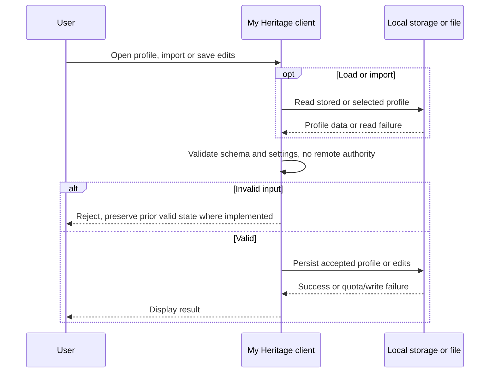
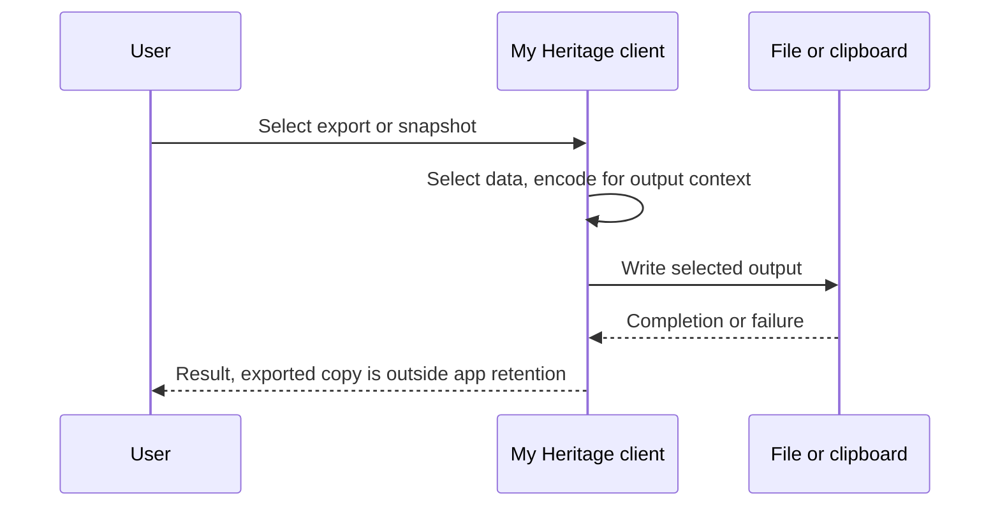
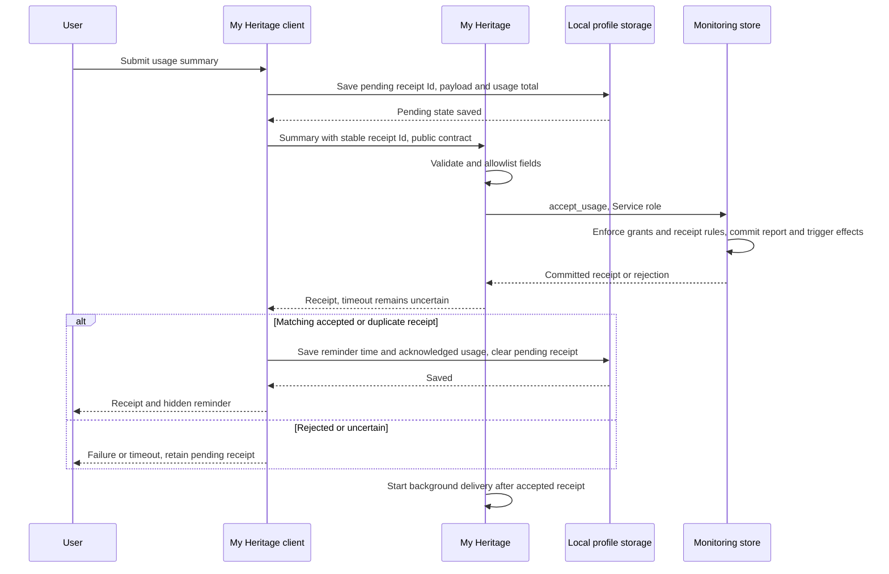
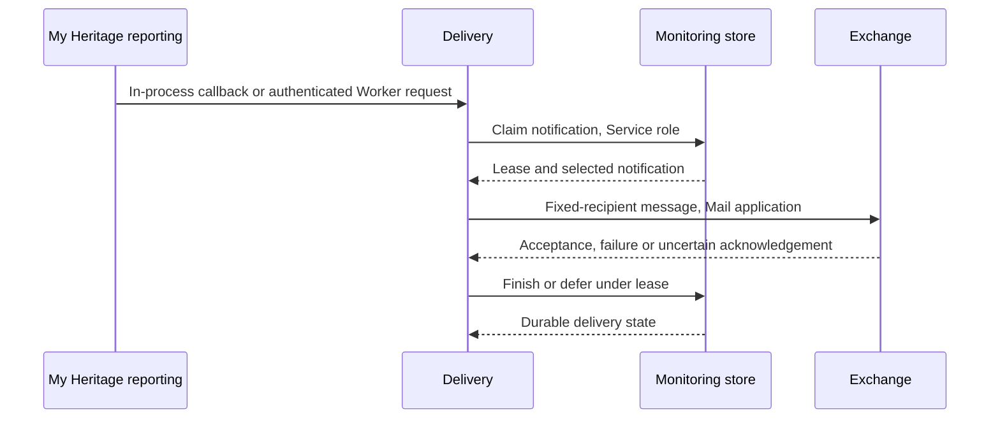
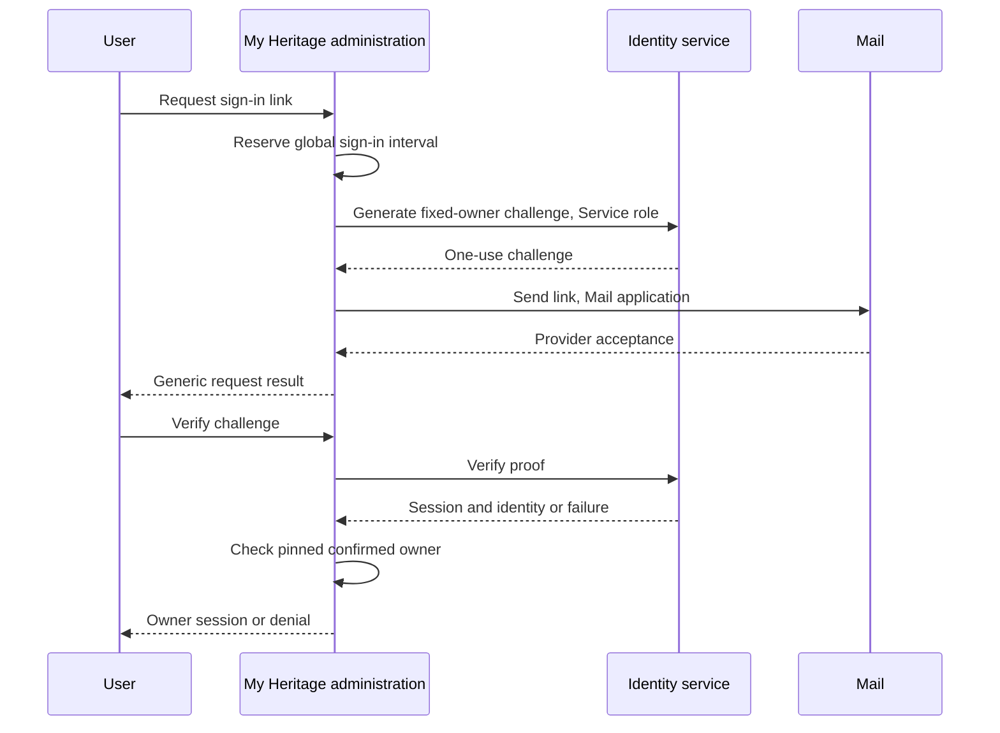
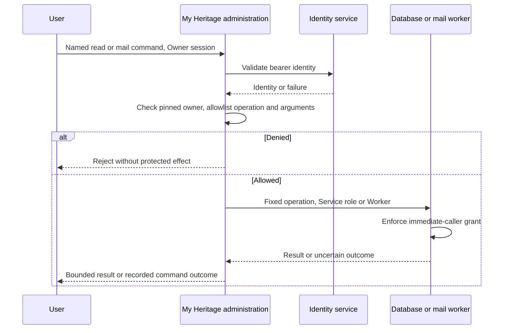
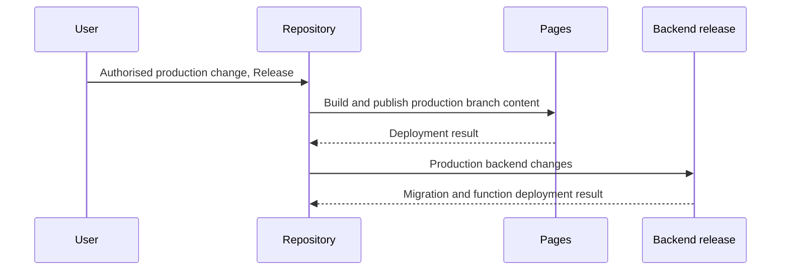
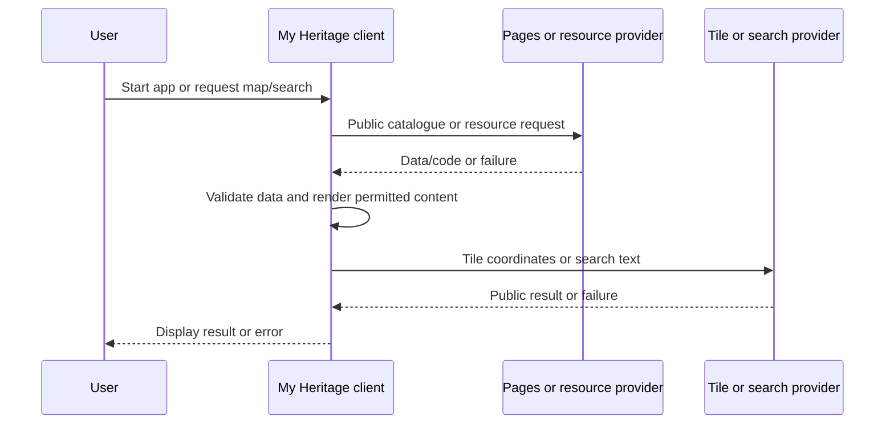
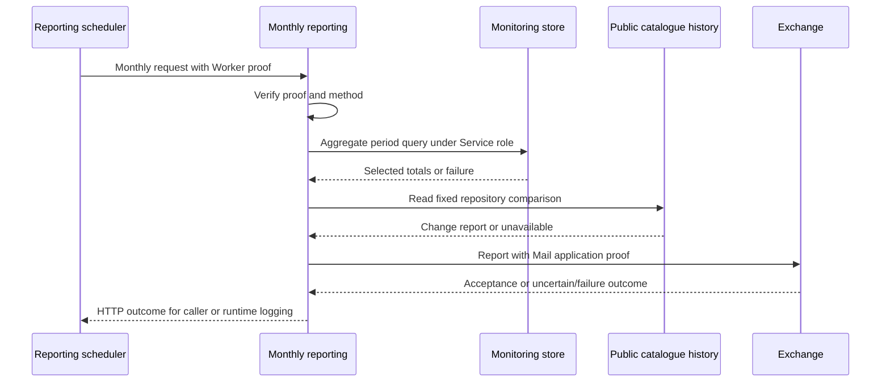

<!-- SYSTEM_BEHAVIOUR.md -->
# My World Heritage — system behaviour

3 October 2026

This design describes the interactions between components in [Architecture](ARCHITECTURE.md), against [Requirements](Requirements.md). It is the canonical home of the message sequence charts (MSCs); the security assessment references these sequences and adds its assurance argument. The charts use Mermaid sequence notation. Component structure remains in the architecture rather than being repeated in each flow.

The source baseline reviewed for this edition is [d766f73](https://github.com/pekka-28/unesco/tree/d766f73d0f27199a5b652fda806a78a65217bb81). These are design descriptions, not evidence that every failure branch has been exercised. [Security policy](SECURITY.md) defines authentication approaches, effective grants and remaining containment limits. A message carrying a service credential does not mean the service independently verifies the originating user's identity.

# Sequence coverage

*Table Sequences* locates each interaction family. Each chart starts with its initiating process and ends at a result or a durable hand-off. Shared charts name their variants; they do not imply that all variants have identical implementation details.

*Table Sequences*

| Interaction | Design section |
| --- | --- |
| Local profile operations | [Local profile operations](#local-profile-operations) |
| Local output | [Local output](#local-output) |
| Accepted report | [Accepted report](#accepted-report) |
| Notification delivery | [Notification delivery](#notification-delivery) |
| Owner authentication | [Owner authentication](#owner-authentication) |
| Owner operation | [Owner operation](#owner-operation) |
| Release | [Release](#release) |
| Visitor resources | [Visitor resources](#visitor-resources) |
| Monthly reporting | [Monthly reporting](#monthly-reporting) |

# Local profile operations

The User process opens, imports or saves a profile. Local validation establishes a usable format, not a remote identity. The intended failure outcome is a visible error without losing a previously valid profile; preservation under quota/write failure remains to be verified. Profile imports and storage writes have distinct code paths. No cloud synchronisation is implied. *Figure Local profile operations* shows the message order.

*Figure Local profile operations*

# Local output

The User process requests profile JSON, a personal HTML summary or a map snapshot. Successful output creates a separate file or clipboard copy outside application retention. Each renderer must encode its output context. A download initiated by the browser does not prove the file was retained. *Figure Local output* shows the message order.

*Figure Local output*

# Accepted report

The User process chooses Submit, accepts a due prompt, or completes enrolment for an adoption report. The client saves a stable receipt Id and payload before sending. The reporting service validates the public contract and commits a record in Submissions. Failed or uncertain delivery leaves the pending receipt for retry. A duplicate acknowledgement is a successful receipt. A later report Name change requires a fresh receipt. Notification delivery is an independent sequence after the commit. *Figure Accepted report* shows the message order.

*Figure Accepted report*

# Notification delivery

An accepted-report callback or the reporting scheduler starts delivery. A worker endpoint checks its worker proof; an in-process callback already runs with the reporting service authority. The database lease limits concurrent claims, not mail-provider duplication after an uncertain acknowledgement. The terminal state is recorded delivery or deferred retry. *Figure Notification delivery* shows the message order.

*Figure Notification delivery*

# Owner authentication

The User process requests and then follows a sign-in link through the administration client. The endpoint creates only a fixed-owner challenge. Verification establishes a session only after the confirmed identity matches the pinned owner. Throttled requests return a generic result. Invalid or expired challenges terminate without an owner session. Neither provider mail acceptance nor the HTTP response proves inbox receipt. *Figure Owner authentication* shows the message order.

*Figure Owner authentication*

# Owner operation

The User process selects a bounded read or named mail operation through the administration client. The endpoint validates the bearer identity and pinned owner before dispatch. Mail operations carry a fresh operation Id and record their outcome; an uncertain outcome requires review before another operation. Read operations return bounded results. No administration command changes the site, catalogue, schema or release. *Figure Owner operation* shows the message order.

*Figure Owner operation*

# Release

The User process proposes a change; approved catalogue automation can also initiate a repository update. Repository rules and grants govern the production branch. Pages and native backend integration consume it separately and can succeed or fail independently. Database migrations are not undone by reverting Git history. Mandatory independent approval and checks are not yet enforced; this flow does not claim otherwise. *Figure Release* shows the message order.

*Figure Release*

# Visitor resources

The User process opens the application, searches or moves the map. Requests disclose the requested resources, tile coordinates or search text to the relevant provider. Startup resource loading and an explicit search are variants of this interaction family; they need not all occur for every request. Detailed visit history stays local unless the user separately exports it. *Figure Visitor resources* shows the message order.

*Figure Visitor resources*

# Monthly reporting

The reporting scheduler initiates the scheduled monthly report. A named owner operation can request a delivery check through the Owner operation sequence. The worker verifies its proof before querying aggregates and catalogue history. Missing catalogue comparisons are reported as unavailable, not as zero changes. The fixed point is a recorded HTTP/provider outcome; uncertain mail acceptance remains a reconciliation concern. *Figure Monthly reporting* shows the message order.

*Figure Monthly reporting*

# Reminder and help timers

The usage reminder is elapsed-time based, not a catalogue-change detector. Its default interval is seven days. The configured interval accepts fractional days: 0.0002 days is 17.28 seconds; 15 days is 1,296,000 seconds. A connected, opted-in client checks every 15 seconds and on startup. When due, startup opens the submission dialog; subsequent timer checks expose the envelope. A matching accepted or duplicate receipt resets the saved reminder time. A clipboard copy or failed request does not. Updated tabs read the latest reminder time for the same profile before checking or saving it. These rules do not provide full concurrent profile-edit synchronisation.

The one-minute startup help timer is independent: interaction cancels that one-time prompt, and an open modal or hidden page prevents it. It does not submit a report. The public [user guide](site/user-guide.html) explains these behaviours from the user's perspective.

# Evidence and unresolved behaviour

The sequence charts state intended checks and outcomes; tests and provider readbacks support specific claims. [Security policy](SECURITY.md) records the verified baseline and open isolation/audit work. [Reminder tests](tests/summary-reminder.test.mjs) exercise receipts, reloads, stale tabs and interval boundaries. [Submission tests](tests/usage-summary.test.mjs), [administration tests](tests/owner-admin.test.mjs) and [delivery tests](tests/new-profile-notifications.test.mjs) cover their named contracts. They do not prove complete browser failure recovery, provider configuration or exactly-once external delivery.
