<!-- SYSTEM_BEHAVIOUR.md -->
# My World Heritage — system behaviour

3 October 2026

This design describes the interactions between components in [Architecture](ARCHITECTURE.md), against [Requirements](Requirements.md). It is the canonical home of the message sequence charts (MSCs); the security assessment references these sequences and adds its assurance argument. The charts use Mermaid sequence notation. Component structure remains in the architecture rather than being repeated in each flow.

The source baseline reviewed for this edition is [9d7a40b](https://github.com/pekka-28/unesco/tree/9d7a40b38c31cf53cfb587998f13b99cf0904647). These are design descriptions, not evidence that every failure branch has been exercised. [Security policy](SECURITY.md) defines authentication approaches, effective grants and remaining containment limits. A message carrying a service credential does not mean the service independently verifies the originating user's identity.

# Sequence coverage

*Table Sequences* locates each interaction family. Each chart starts with its initiating process and ends at a result or a durable hand-off. Shared charts name their variants; they do not imply that all variants have identical implementation details.

*Table Sequences*

| Interaction | Design section |
| --- | --- |
| Local profile operations | [Local profile operations](#local-profile-operations) |
| Local output | [Local output](#local-output) |
| Accepted report | [Accepted report](#accepted-report) |
| Notification delivery | [Notification delivery](#notification-delivery) |
| Request owner sign-in | [Owner authentication](#owner-authentication) |
| Complete owner sign-in | [Owner session establishment](#owner-session-establishment) |
| Reopen administration | [Administration startup](#administration-startup) |
| Owner query | [Owner operation](#owner-operation) |
| Owner mail command | [Owner mail operations](#owner-mail-operations) |
| Export owner results | [Administration result export](#administration-result-export) |
| Owner sign-out | [Owner sign-out](#owner-sign-out) |
| Release | [Release](#release) |
| Visitor resources | [Visitor resources](#visitor-resources) |
| Monthly reporting | [Monthly reporting](#monthly-reporting) |

# Local profile operations

The User process opens, imports or saves a profile. Local validation establishes a usable format, not a remote identity. The intended failure outcome is a visible error without losing a previously valid profile; preservation under quota/write failure remains to be verified. Profile imports and storage writes have distinct code paths. No cloud synchronisation is implied. *Figure Local profile operations* shows the message order.

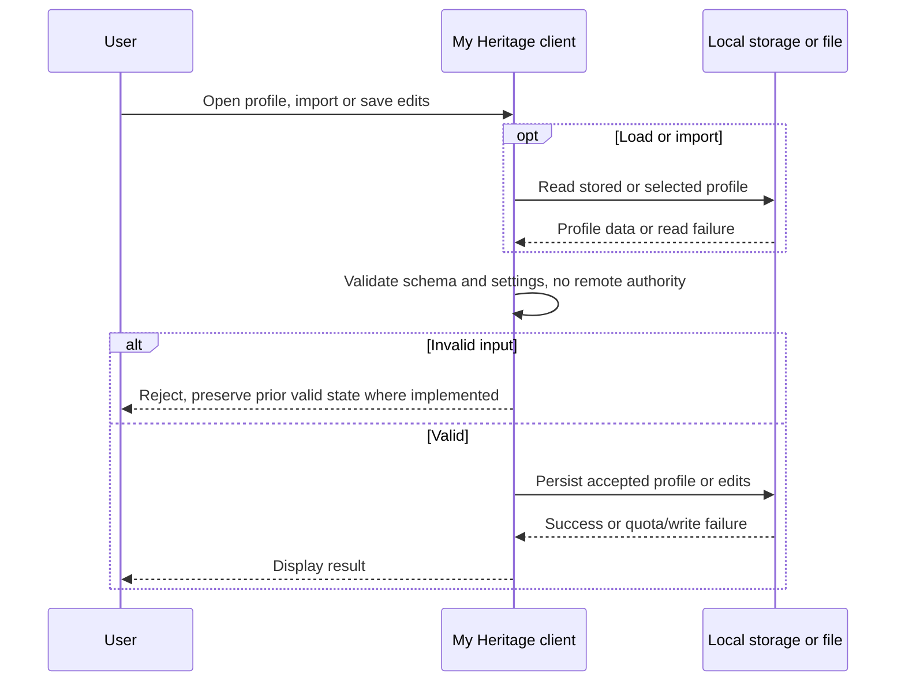

*Figure Local profile operations*

# Local output

The User process requests profile JSON, a personal HTML summary or a map snapshot. Successful output creates a separate file or clipboard copy outside application retention. Each renderer must encode its output context. A download initiated by the browser does not prove the file was retained. *Figure Local output* shows the message order.

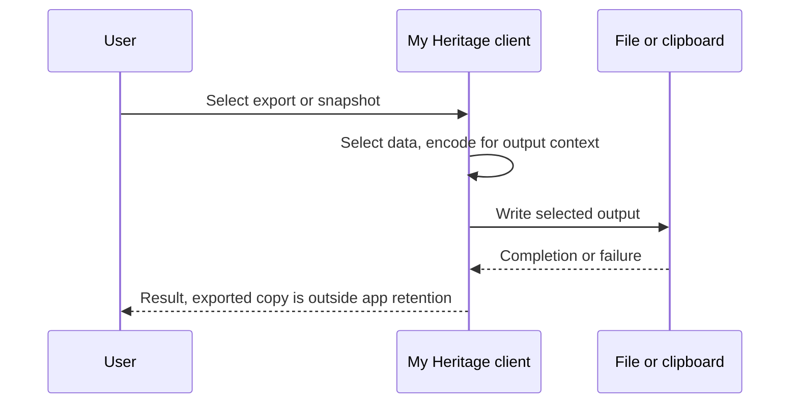

*Figure Local output*

# Accepted report

The User process chooses Submit, accepts a due prompt, or completes enrolment for an adoption report. The client saves a stable receipt Id and payload before sending. The reporting service validates the public contract and commits a record in Submissions. Failed or uncertain delivery leaves the pending receipt for retry. A duplicate acknowledgement is a successful receipt. A later report Name change requires a fresh receipt. Notification delivery is an independent sequence after the commit. *Figure Accepted report* shows the message order.

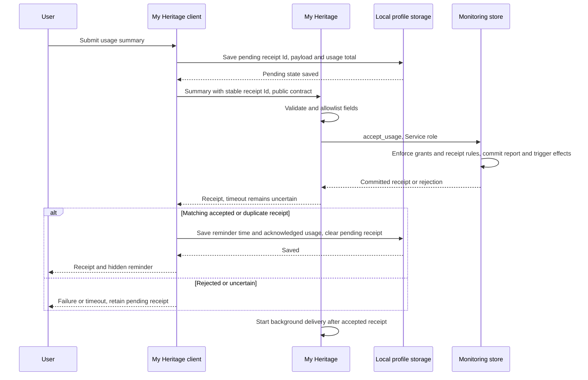

*Figure Accepted report*

# Notification delivery

An accepted-report callback or the reporting scheduler starts delivery. A worker endpoint checks its worker proof; an in-process callback already runs with the reporting service authority. The database lease limits concurrent claims, not mail-provider duplication after an uncertain acknowledgement. The terminal state is recorded delivery or deferred retry. *Figure Notification delivery* shows the message order.

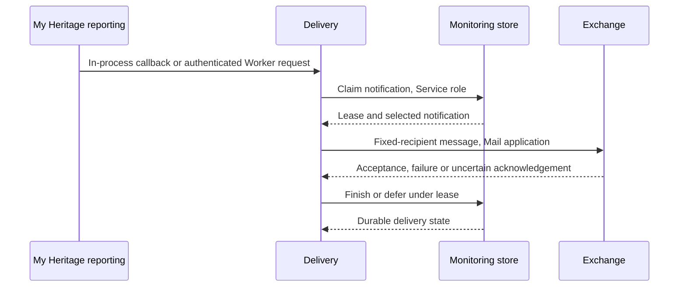

*Figure Notification delivery*

# Administration client

The [administration client](admin/index.html) is a separate browser interface at `/admin/`, implemented in [admin.ts](site/src/admin.ts). It presents owner sign-in, bounded query results and three named mail commands. Its fixed endpoint is the [administration service](supabase/functions/owner-admin/handler.mjs). It does not use the visitor's local profile as an identity or send that profile to administration.

The client holds the current access token in memory and in tab-scoped `sessionStorage`, with an expiry timestamp. It stores no refresh token. A sign-in link carries a one-use challenge in its URL fragment; the client captures it in memory and removes the fragment from the address bar before proceeding. Query results remain in memory and the page until replaced or cleared; a download creates a separate copy. Visitor and administration pages share an origin, so separate paths do not establish a browser security boundary.

The interface hides controls while signed out and disables buttons while one request is pending. These are interaction controls: the service independently authenticates every protected request, checks the pinned owner and restricts the requested operation. The browser has neither a release credential nor a generic SQL execution control. *Table Administration interactions* maps its inputs and effects to the sequences below.

*Table Administration interactions*

| Client action | Service request or local effect | Sequence |
| --- | --- | --- |
| Email my sign-in link | `login` | [Owner authentication](#owner-authentication) |
| Continue with this sign-in link | `verify` with one-use challenge | [Owner session establishment](#owner-session-establishment) |
| Open or reload administration | Read unexpired tab session, then Database status query | [Administration startup](#administration-startup) |
| Query or page results | `read`, or `runs` for Workflow status | [Owner operation](#owner-operation) |
| Send test email, monthly check or retry notifications | Named command with fresh operation Id | [Owner mail operations](#owner-mail-operations) |
| Download these results | Local JSON download of current result | [Administration result export](#administration-result-export) |
| Sign out | `logout`, then clear local session and results | [Owner sign-out](#owner-sign-out) |

# Owner authentication

The User process selects Email my sign-in link. The administration client sends `login` to its fixed service, which reserves the shared sign-in interval before generating a fixed-owner challenge. A throttled request still receives the generic result. Provider acceptance does not prove inbox receipt. This sequence ends at the displayed request outcome; following the delivered link starts [Owner session establishment](#owner-session-establishment). *Figure Owner authentication* shows the request path.

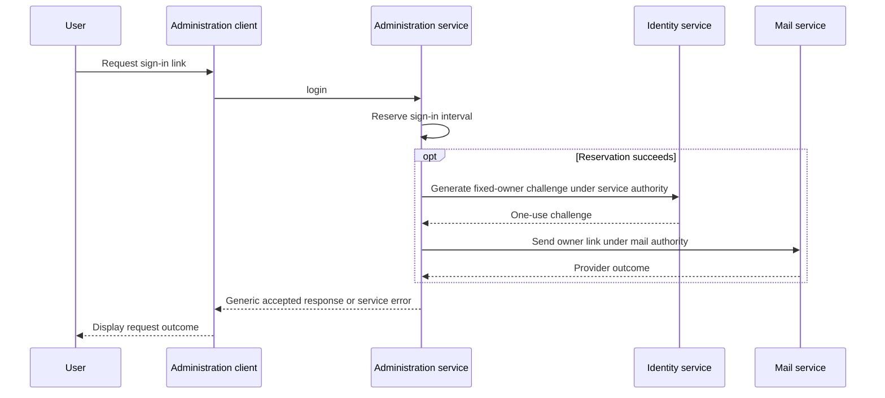

*Figure Owner authentication*

# Owner session establishment

Opening the emailed link loads the client and captures the challenge. The User process must then select Continue with this sign-in link. The service verifies the challenge and pinned, confirmed owner before returning an access token and lifetime. An invalid or expired challenge ends without a new owner session. On success the client saves the tab session and performs the Database status query defined in [Owner operation](#owner-operation). *Figure Owner session establishment* identifies the client and identity checks separately.

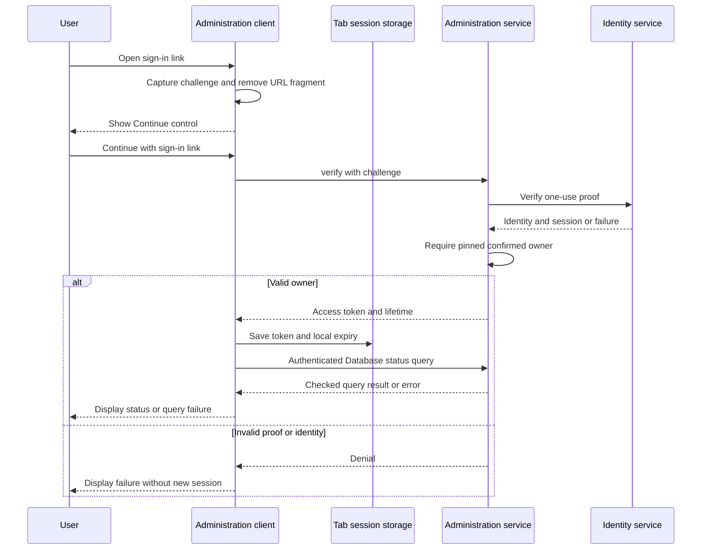

*Figure Owner session establishment*

# Administration startup

Reopening the administration page restores only a saved token whose local expiry is in the future. This local check controls presentation; it does not establish server authority. An unexpired token triggers the same authenticated Database status query. The client has no renewal flow: a service response of 401 or 403 clears the saved token and hides the workspace, and the User process must request another sign-in link. A token that expires while the page is open is rejected on a later protected request; there is no separate expiry timer. *Figure Administration startup* ends with a sign-in prompt or checked status result.

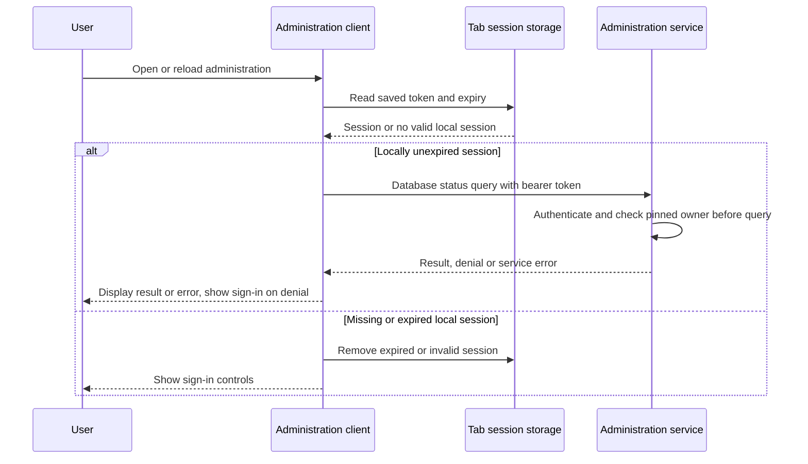

*Figure Administration startup*

# Owner operation

The User process selects an entity and Query, or pages an existing query. The client sends only relevant filters: profile identifier for Profiles, Submissions and Notifications; record class for Submissions; UTC start/end dates for Submissions and Authentication audit, with an exclusive end. A new Query resets the offset. Database queries return at most 100 rows per page. Workflow status uses a fixed GitHub read of the latest 20 runs, not a database query or workflow-dispatch command.

The service validates the bearer identity, pinned owner, entity and arguments before reading. The client renders values as text in a table, with column widths fitted to content and displayed timestamps omitting fractional seconds. Raw result values remain available for export. A 401 or 403 clears local session authority and hides the workspace; other failures show an error. A failed query can leave the preceding result in memory, so it must not be mistaken for a new successful result. *Figure Owner operation* covers queries and their checked result.

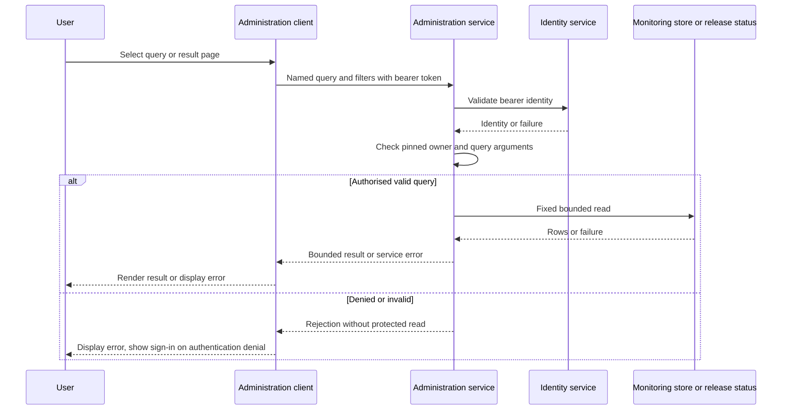

*Figure Owner operation*

# Owner mail operations

The client exposes Send test email, Send monthly report check and Retry pending notifications. Selecting a command creates a fresh operation Id; it does not ask for another confirmation. The service checks owner authority, rejects an already recorded Id, records a started operation, invokes the permitted worker and records success or uncertainty. The workers apply their own immediate-caller authentication and fixed-recipient restrictions. No command changes the site, catalogue, schema or deployment.

The client allows one active request, uses a 70-second request timeout and displays the response. A timeout does not prove that mail was not sent. Another click creates a new operation Id rather than retrying the previous command: inspect Action history and the mail outcome before trying again. Recorded worker completion is not a guarantee of inbox receipt. *Figure Owner mail operations* shows the durable operation record as distinct from the browser result.

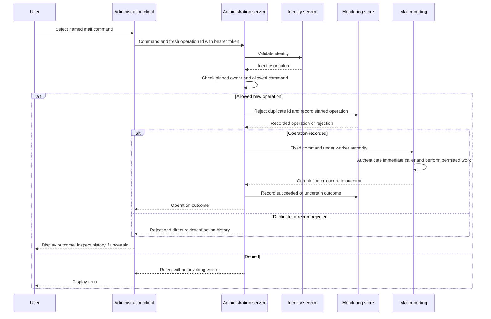

*Figure Owner mail operations*

# Administration result export

Download these results serialises the current result retained by the client into `mwh-admin-results.json`. It exports the current page or result, not every matching database row, and preserves timestamp precision omitted from the display. This is local egress: there is no second server query or new authorisation request. The downloaded private copy has its own access and retention obligations. *Figure Administration result export* ends when the browser starts the download; that does not prove the file was retained.

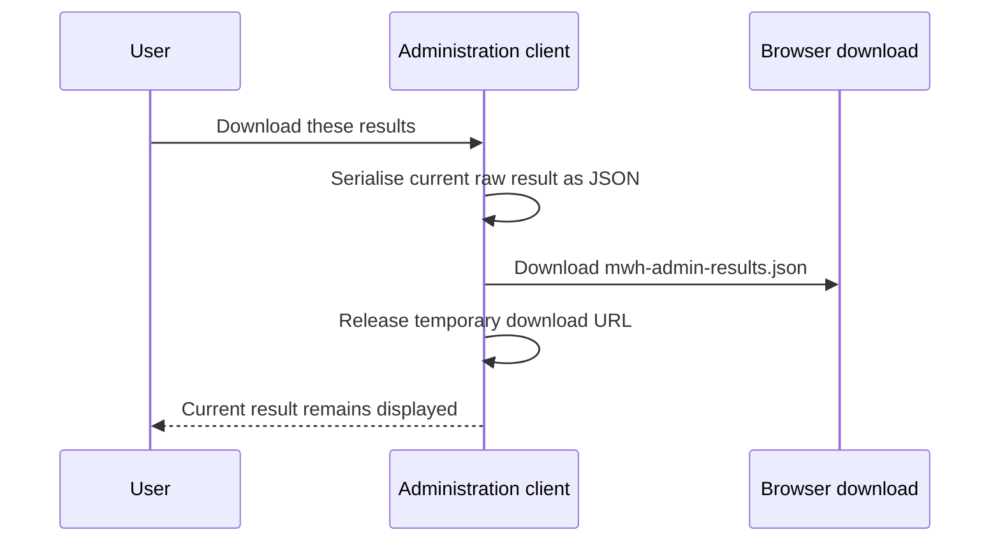

*Figure Administration result export*

# Owner sign-out

The client requests authenticated sign-out from the service, which checks the pinned owner and calls the identity service. Whether that request succeeds or fails, the client removes its token from memory and tab storage, clears the displayed results and shows sign-in controls. Failure therefore ends local access without proving remote revocation. Existing token validity follows the identity service's session rules; local removal does not revoke separately retained copies. *Figure Owner sign-out* distinguishes remote outcome from local cleanup.

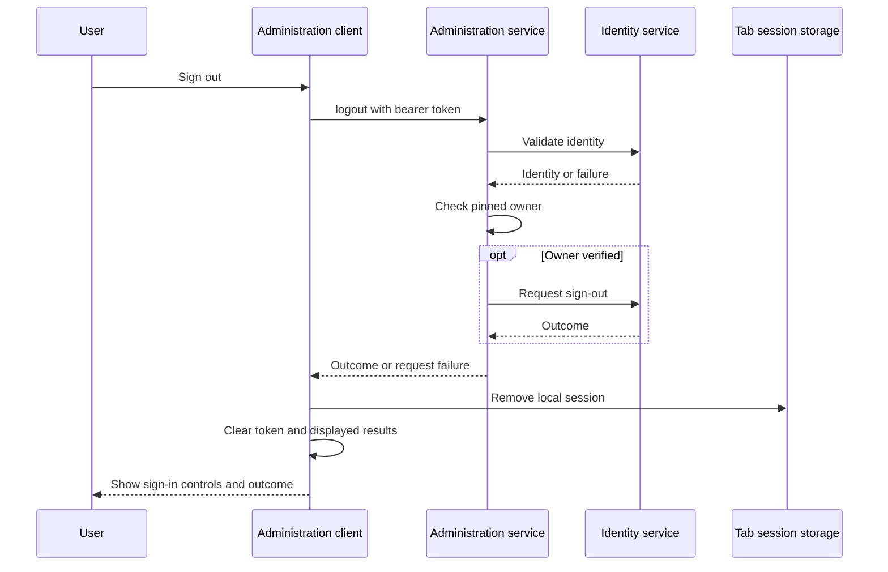

*Figure Owner sign-out*

# Release

The User process proposes a change; approved catalogue automation can also initiate a repository update. Repository rules and grants govern the production branch. Pages and native backend integration consume it separately and can succeed or fail independently. Database migrations are not undone by reverting Git history. Mandatory independent approval and checks are not yet enforced; this flow does not claim otherwise. *Figure Release* shows the message order.

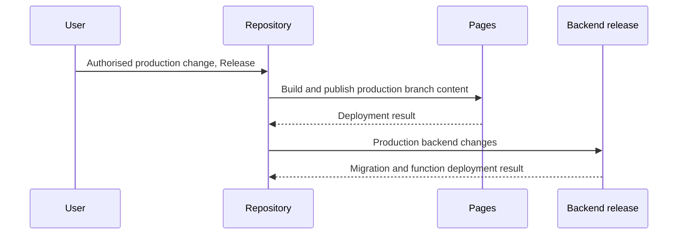

*Figure Release*

# Visitor resources

The User process opens the application, searches or moves the map. Requests disclose the requested resources, tile coordinates or search text to the relevant provider. Startup resource loading and an explicit search are variants of this interaction family; they need not all occur for every request. Detailed visit history stays local unless the user separately exports it. *Figure Visitor resources* shows the message order.

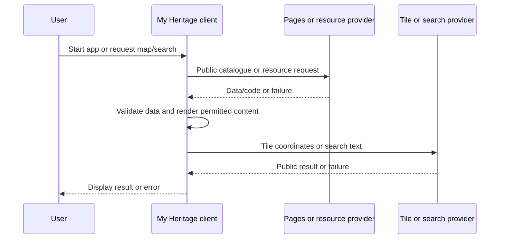

*Figure Visitor resources*

# Monthly reporting

The reporting scheduler initiates the scheduled monthly report. A named owner operation can request a delivery check through the Owner operation sequence. The worker verifies its proof before querying aggregates and catalogue history. Missing catalogue comparisons are reported as unavailable, not as zero changes. The fixed point is a recorded HTTP/provider outcome; uncertain mail acceptance remains a reconciliation concern. *Figure Monthly reporting* shows the message order.

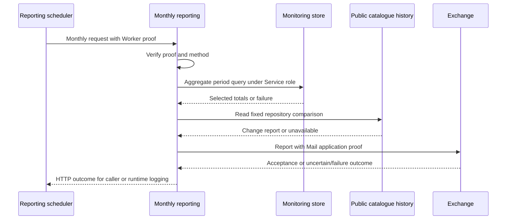

*Figure Monthly reporting*

# Reminder and help timers

The usage reminder is elapsed-time based, not a catalogue-change detector. Its default interval is seven days. The configured interval accepts fractional days: 0.0002 days is 17.28 seconds; 15 days is 1,296,000 seconds. A connected, opted-in client checks every 15 seconds and on startup. When due, startup opens the submission dialog; subsequent timer checks expose the envelope. A matching accepted or duplicate receipt resets the saved reminder time. A clipboard copy or failed request does not. Updated tabs read the latest reminder time for the same profile before checking or saving it. These rules do not provide full concurrent profile-edit synchronisation.

The one-minute startup help timer is independent: interaction cancels that one-time prompt, and an open modal or hidden page prevents it. It does not submit a report. The public [user guide](site/user-guide.html) explains these behaviours from the user's perspective.

# Evidence and unresolved behaviour

The sequence charts state intended checks and outcomes; tests and provider readbacks support specific claims. [Security policy](SECURITY.md) records the verified baseline and open isolation/audit work. [Reminder tests](tests/summary-reminder.test.mjs) exercise receipts, reloads, stale tabs and interval boundaries. [Submission tests](tests/usage-summary.test.mjs), [administration tests](tests/owner-admin.test.mjs) and [delivery tests](tests/new-profile-notifications.test.mjs) cover their named contracts. They do not prove complete browser failure recovery, provider configuration or exactly-once external delivery.
