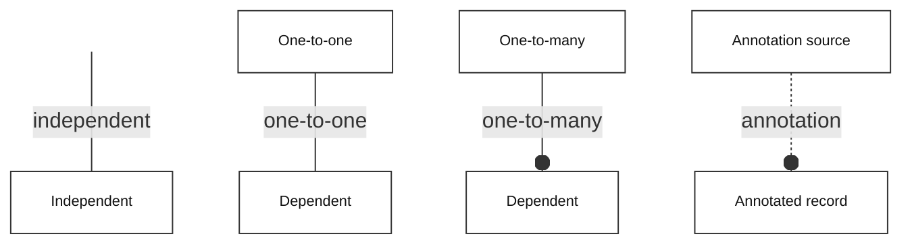
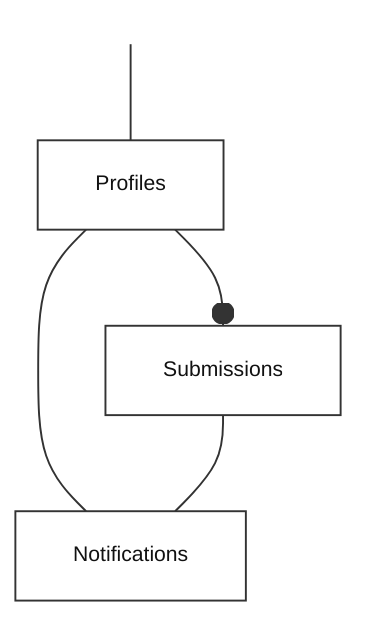

<!-- SCHEMA.md -->
# Supabase monitoring schema

My World Heritage is a map-based companion for recording visits to UNESCO World Heritage sites. Its Requirements define the product and privacy boundaries [1]; its Architecture describes the components [2]. This schema specifies the Supabase monitoring store and database APIs that accept voluntary usage summaries, calculate aggregate activity and arrange owner notifications. Personal profiles, names, locations and individual visit histories remain in the browser. Supabase-managed Vault, Cron and HTTP extension tables support operations but are not application entities.

# Application entity model

The entity model uses the Bachman notation shown in *Figure Bachman legend*. An open circle marks the many side. A plain line represents a one-to-one dependency. A dashed annotation line records non-identifying association or provenance, without implying key inheritance. The visible line from an invisible point identifies an independent entity.

*Figure Bachman legend*

*Figure Application entity model* shows database entity dependencies. Each record in **Profiles** can have many records in **Submissions** and at most one in **Notifications**. A record in **Notifications** requires the first accepted record in **Submissions** for its corresponding record in **Profiles**. A record in **Submissions** can exist without a corresponding record in **Notifications**, including after historical baselining. Solid lines express these dependencies; their database enforcement is identified in *Table Schema maintenance*.

*Figure Application entity model*

A record in **Submissions** represents an accepted report. A record in **Notifications** represents the single alert caused by the first accepted record in **Submissions** for a record in **Profiles**. The current trigger creates these records in one transaction. The SQL does not yet declare a foreign key from **Notifications** to **Submissions**. Their primary keys are separate identities, while the unique profile key in **Notifications** limits each profile to one alert.

*Table Monitoring entities* summarises **Profiles**, **Submissions** and **Notifications**. Their columns are defined in *Table Profiles*, *Table Submissions* and *Table Notifications*. All sample values are synthetic. PK denotes primary key, FK foreign key and UQ unique constraint; a dash means none of these.

*Table Monitoring entities*

| Entity | SQL table | Purpose |
| --- | --- | --- |
| **Profiles** | `public.known_usage_profiles` | Remember previously seen profiles, including any migration baseline |
| **Submissions** | `public.usage_submissions` | Retain accepted reports and support idempotent receipts and aggregate reporting |
| **Notifications** | `public.new_profile_notifications` | Queue one alert per newly seen profile and track delivery/retries |

*Table Profiles*

| Column | PostgreSQL type | Key | Sample data |
| --- | --- | --- | --- |
| `magic_cookie` | text, not null | PK | `0123456789abcdef` |
| `first_received_at` | timestamptz, not null | — | `2026-10-02T02:00:00Z` |
| `reporting_alias` | text, not null | — | `Visitor A` |

*Table Submissions*

| Column | PostgreSQL type | Key | Sample data |
| --- | --- | --- | --- |
| `submission_id` | text, not null | PK | `sample-receipt-1` |
| `received_at` | timestamptz, not null | — | `2026-10-02T02:00:00Z` |
| `submitted_at` | timestamptz, not null | — | `2026-10-02T01:59:59Z` |
| `magic_cookie` | text, not null | — | `0123456789abcdef` |
| `use_count` | integer, nullable for non-activity records | — | `3` |
| `visited_count` | integer, nullable for non-activity records | — | `4` |
| `event_type` | text, not null | — | `manual` |
| `client_version` | text, not null | — | `0.2.1` |
| `payload` | jsonb, not null | — | `{"submission_id":"sample-receipt-1","submitted_at_utc":"2026-10-02T01:59:59Z","magic_cookie":"0123456789abcdef","use_count_since_last_push":3,"visited_site_count":4,"event_type":"manual","client_version":"0.2.1"}` |
| `record_class` | text, not null | — | `activity` |
| `legacy_source` | text, nullable | — | `my-world-heritage` |
| `reporting_alias` | text, not null | — | `Visitor A` |

*Table Notifications*

| Column | PostgreSQL type | Key | Sample data |
| --- | --- | --- | --- |
| `id` | uuid, not null | PK | `00000000-0000-4000-8000-000000000001` |
| `magic_cookie` | text, not null | FK, UQ | `0123456789abcdef` |
| `submission_id` | text, not null | — | `sample-receipt-1` |
| `first_received_at` | timestamptz, not null | — | `2026-10-02T02:00:00Z` |
| `event_type` | text, not null | — | `manual` |
| `visited_count` | integer, not null | — | `4` |
| `attempts` | integer, not null | — | `1` |
| `available_at` | timestamptz, not null | — | `2026-10-02T02:00:00Z` |
| `lease_token` | uuid, nullable | — | `null` |
| `lease_until` | timestamptz, nullable | — | `null` |
| `sent_at` | timestamptz, nullable | — | `2026-10-02T02:00:01Z` |
| `last_error` | text, nullable | — | `null` |
| `reporting_alias` | text, not null | — | `Visitor A` |

# Constraints and access

A record in **Notifications** references a record in **Profiles** through the declared foreign key from `new_profile_notifications.magic_cookie` to `known_usage_profiles.magic_cookie`. `usage_submissions.magic_cookie` and `new_profile_notifications.submission_id` have no declared foreign keys. Inserting a record in **Submissions** runs the trigger that creates the corresponding records in **Profiles** and **Notifications** when the profile is first seen. These changes are atomic. Baselining records in **Profiles** before historical import suppresses retrospective alerts.

Usage and visited counts must be non-negative and are mandatory for `activity` records. Historical `test` and `synthetic` records can preserve missing counts as null. Public submission event types remain `adoption`, `manual` or `periodic`; the database also retains the historical synthetic event `patch`. `record_class` defaults to `activity`, and the public ingest API does not let clients set this classification. `legacy_source` retains a historical diagnostic source label. `usage_stats` includes only `activity` records [6]. Receipt time defaults to the server clock for new reports; historical import preserves the original receipt time.

The optional `reporting_alias` is limited to 80 characters without control characters. It is stored in **Submissions**, **Profiles** and **Notifications**, and included in the initial owner email when supplied [7]. The client offers a separate reporting-alias field and does not automatically share the required local display name. An empty field omits the alias from a new record in **Submissions**; it does not erase existing records or their recorded aliases. Historical aliases come from the owner-supplied workbook.

All three tables enable row-level security and deny direct access to anonymous and authenticated browser roles. Edge Functions use the server-held service role for their restricted database operations. Monthly reporting reads aggregates through `usage_stats`; it has no separate application table. The monthly delivery check and first-profile email were confirmed received by the owner on 2 October 2026; recurring monthly scheduling remains inactive.

# Database APIs

Table definitions alone do not specify the API. *Table Database APIs* documents the SQL functions used by the Edge Functions and scheduler. The public browser interface appears separately in *Table HTTP interfaces*. Only `usage-summary` accepts browser requests; browsers cannot call the SQL APIs directly. SQL exceptions roll back their transaction; the ingest Edge Function maps rate limits to HTTP 429 and other database failures to HTTP 503.

*Table Database APIs*

| SQL signature | Caller | Result | Effect |
| --- | --- | --- | --- |
| `accept_usage(p jsonb)` | Service role | JSON with `ok`, `duplicate`, `submission_id` | Atomically inserts a record in **Submissions** for a validated summary and runs the new-profile trigger; identical retries reuse the receipt |
| `usage_stats(start_at timestamptz, end_at timestamptz)` | Service role | JSON counts and average | Reads records in **Submissions** received in the half-open interval `[start_at, end_at)`; returns submissions, active profiles, latest-per-profile average visited count, reported uses and event-type counts |
| `usage_histogram()` | Service role | Visibility flag and ten relative-height buckets | Uses the latest activity record in **Submissions** for each profile; always returns ten buckets and never returns exact bucket counts |
| `claim_new_profile_notifications(p_submission_id text = null, p_limit integer = 10)` | Service role | Set of records in **Notifications** | Claims due, unsent records in **Notifications** with no active lease, optionally for one record in **Submissions**; clamps batch size to 1–10, increments attempts and assigns five-minute leases |
| `finish_new_profile_notification(p_id uuid, p_lease_token uuid, p_success boolean)` | Service role | Boolean | Updates an unsent record in **Notifications** with the matching claim token; records success or retry backoff, clears the lease, and returns whether a record matched |
| `dispatch_new_profile_notifications()` | PostgreSQL scheduler owner | HTTP request ID or null | Reads the private URL/token from Vault and requests the worker only when due records in **Notifications** exist; returns null when work or configuration is absent |
| `enqueue_new_profile_notification()` | `usage_new_profile` trigger | Inserted record in **Submissions** | Inserting a record in **Submissions** creates records in **Profiles** and **Notifications** for an unseen profile in the same transaction |

*Table HTTP interfaces*

| Method and function path | Access | Request | Response |
| --- | --- | --- | --- |
| `POST /functions/v1/usage-summary` | Public, permitted browser origin | Validated summary JSON under the byte limit | Accepted receipt, validation error, rate limit or retryable service failure |
| `GET /functions/v1/usage-summary?stats=1` | Public, permitted browser origin | No body | Coarse active-profile count and average visited sites for the last 14 days |
| `GET /functions/v1/usage-summary?histogram=1` | Public, permitted browser origin | No body | Ten data-scaled buckets and relative heights from each known profile's latest activity report, regardless of age; empty populations produce ten empty buckets |
| `GET /functions/v1/usage-summary` | Public | No body | Service/version status |
| `OPTIONS /functions/v1/usage-summary` | Permitted browser origin | CORS preflight | HTTP 204 and allowed methods/headers |
| `POST /functions/v1/new-profile-notifications` | Private worker bearer token | Empty JSON body | Delivery batch result; `x-mwh-delivery-test: true` sends only the authorised test mail |
| `POST /functions/v1/monthly-report` | Private worker bearer token | Empty JSON body | HTTP 202 after Exchange acceptance; `x-mwh-report-test: true` adds a labelled month-to-date check |

The accepted summary contains a stable submission ID, UTC submission time, pseudonymous profile key, use count, visited-site count, event type, client version and optional reporting alias. The Edge Function sanitises the input before calling `accept_usage`; the SQL function is not a public validation boundary. An identical ID/payload is accepted before rate limiting; a conflicting payload for an existing ID raises an error. Per profile, new reports are limited to one per 30 seconds and 12 per rolling hour. The payload allow-list excludes the local profile name, locations, visits, notes, tokens and browser user agents.

# Delivery leases

The immediate sender and the minute-by-minute retry worker can claim the same alert concurrently. `claim_new_profile_notifications` locks candidate records in **Notifications** with `FOR UPDATE SKIP LOCKED`, writes a random `lease_token` and a `lease_until` time five minutes ahead, then commits. The lease keeps ownership visible while the worker makes the external Exchange request without holding a database transaction open.

If the worker crashes, another worker can reclaim the record in **Notifications** after expiry. Reclaiming replaces the token, so a late completion from the previous worker cannot overwrite the new claim. `finish_new_profile_notification` checks the stored token, rather than independently checking lease expiry. Normal completion clears the lease. Failures set `available_at` using exponential backoff capped at one hour.

Some form of claim coordination is necessary with these concurrent delivery paths. This lease is useful because it combines exclusion during sending with recovery after a crash. Five minutes is an operational timeout, not a business rule. It does not guarantee exactly-once delivery: Exchange may accept a message before a lost acknowledgement or worker crash, leaving a later retry able to resend it.

# Usage histogram

The My World Heritage dialog shows exactly ten equal-width buckets from the minimum reported visit count to one above the maximum integer count. Lower bounds are inclusive and upper bounds exclusive. The displayed boundary labels are rounded to whole numbers; the underlying bucket boundaries and sample selection are unchanged. Even a single observed value produces ten buckets. For each record in **Profiles**, the histogram uses the latest matching `activity` record in **Submissions** across the full stored history, where one exists. Records classified as test or synthetic do not contribute [8].

There is no minimum reporting population. The chart always displays ten buckets, with zero heights when no activity records exist [9]. For non-empty populations, bar heights are normalised to the tallest bar; the API omits absolute bucket counts, aliases and profile identifiers. The chart has no numeric frequency axis, count labels or count tooltips. Relative shapes still communicate distribution; this is not a formal anonymity guarantee.

# Schema maintenance

Schema changes are maintained as ordered SQL migration scripts under `supabase/migrations/`. These scripts contain the SQL data definition language (DDL) statements that install and evolve the store. They define the tables, constraints, functions, grants and trigger; the scheduler migration also installs extension dependencies and registers its job. *Table Schema maintenance* maps this specification to exact SQL object names so a reviewer can follow the implementation without relying on shifting line numbers. No consolidated schema file supersedes these migrations.

*Table Schema maintenance*

| Schema element | Script | Definition/enforcement |
| --- | --- | --- |
| **Submissions** and column/check constraints | [Usage reporting store](migrations/202610010001_usage_summary.sql) | `CREATE TABLE public.usage_submissions` |
| **Profiles** | [Profile registration and notifications](migrations/202610020001_new_profile_notifications.sql) | `CREATE TABLE public.known_usage_profiles` and initial baseline insert |
| **Notifications** and queue fields | [Profile registration and notifications](migrations/202610020001_new_profile_notifications.sql) | `CREATE TABLE public.new_profile_notifications` |
| **Profiles** to **Notifications**, at most one | [Profile registration and notifications](migrations/202610020001_new_profile_notifications.sql) | Queue `magic_cookie` is not null, unique and references the profile primary key |
| **Profiles** to **Submissions**, one-to-many | [Profile registration and notifications](migrations/202610020001_new_profile_notifications.sql) | `enqueue_new_profile_notification` inserts the registry entry; no foreign key from **Submissions** to **Profiles** is declared |
| First record in **Submissions** to **Notifications**, at most one | [Profile registration and notifications](migrations/202610020001_new_profile_notifications.sql) | `usage_new_profile` inserts a record in **Notifications** with `new.submission_id`; no foreign key or unique constraint on notification `submission_id` is declared |
| Acceptance and aggregate APIs | [Usage reporting store](migrations/202610010001_usage_summary.sql) | `accept_usage`, `usage_stats` and their execute grants |
| Claim/completion APIs | [Profile registration and notifications](migrations/202610020001_new_profile_notifications.sql) | `claim_new_profile_notifications`, `finish_new_profile_notification` and their execute grants |
| Scheduled dispatch API and retry job | [Notification retry scheduling](migrations/202610020002_notification_retry_schedule.sql) | `dispatch_new_profile_notifications`, `cron.schedule` and extension creation |
| Table privacy | [Usage reporting store](migrations/202610010001_usage_summary.sql), [Profile registration and notifications](migrations/202610020001_new_profile_notifications.sql) | Row-level security plus table/function grants and revocations |
| Historical classification and activity-only aggregates | [Historical report classification](migrations/202610020003_historical_report_classes.sql) | `record_class`, `legacy_source`, conditional count constraint, historical `patch` event, replacement `usage_stats` |
| Optional reporting alias and adoption email snapshot | [Optional reporting aliases](migrations/202610020004_optional_reporting_alias.sql) | Alias columns/checks on all three tables; replacements for `accept_usage` and `enqueue_new_profile_notification` |
| Histogram sampling and binning | [Initial visited-site histogram](migrations/202610020005_usage_histogram.sql) | Initial `usage_histogram`, restricted execute grant and normalised bucket heights |
| Always-visible histogram | [All-profile histogram](migrations/202610020006_always_show_histogram.sql) | Replaces the three-argument function with `usage_histogram()`; removes the age filter and floor and returns empty bins |

The missing foreign keys are an implementation limitation, not evidence that the relationships are optional. Current ingest maintains them through its trigger. Administrative imports must preserve them explicitly. A later integrity migration could enforce them declaratively; this documentation correction does not silently change the live database schema.

# Historical import

On 2 October 2026 the owner-supplied workbook contributed 42 records in **Submissions**: 26 activity, three test and 13 synthetic records. All source records were retained; 41 carried an alias and one had no alias. The import preserved receipt times using the confirmed Africa/Johannesburg time zone and repaired the workbook's mixed event/source column layouts. Missing counts in diagnostic records remain null. Normal activity statistics omit test and synthetic records.

The original workbook, its checksum, row-level conversion audit and prepared SQL remain private. The import baselined records in **Profiles** before inserting records in **Submissions**, and created no record in **Notifications**. Deterministic historical receipt IDs and an existing-record check make repeated imports idempotent. The preparation utility is [prepare_legacy_usage_import.py](../scripts/prepare_legacy_usage_import.py); it does not itself connect to or modify Supabase. No new public import API was introduced.

# References

The project specifications and implementation references are:

1. [My World Heritage requirements](../Requirements.md) (Requirements), My World Heritage project, 2 October 2026.
2. [System architecture](../ARCHITECTURE.md) (Architecture), My World Heritage project, 2 October 2026.
3. [Usage reporting store](migrations/202610010001_usage_summary.sql) (Reporting store), My World Heritage project, 1 October 2026.
4. [Profile registration and notifications](migrations/202610020001_new_profile_notifications.sql) (Notifications), My World Heritage project, 2 October 2026.
5. [Notification retry scheduling](migrations/202610020002_notification_retry_schedule.sql) (Retry scheduling), My World Heritage project, 2 October 2026.
6. [Historical report classifications](migrations/202610020003_historical_report_classes.sql) (Report classification), My World Heritage project, 2 October 2026.
7. [Optional reporting alias](migrations/202610020004_optional_reporting_alias.sql) (Reporting aliases), My World Heritage project, 2 October 2026.
8. [Initial visited-site histogram](migrations/202610020005_usage_histogram.sql) (Initial histogram), My World Heritage project, 2 October 2026.
9. [All-profile histogram](migrations/202610020006_always_show_histogram.sql) (Histogram), My World Heritage project, 2 October 2026.
