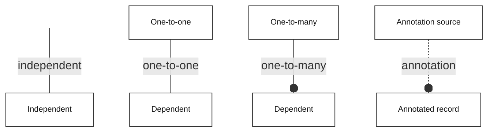
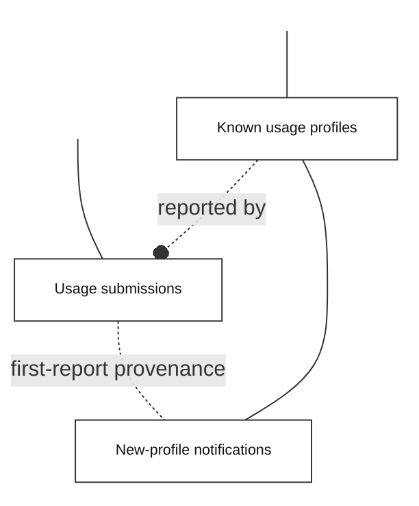

<!-- SCHEMA.md -->
# Supabase monitoring schema

This document describes the three application tables installed by the usage-summary and new-profile-notification migrations. The database holds pseudonymous reporting summaries and delivery state; profiles, names, locations and individual visit histories remain in browser storage. Supabase-managed Vault, Cron and HTTP extension tables support operations and are outside this application schema.

# Bachman notation

*Figure Bachman legend* follows the parent Style guide. An open circle marks the many side. A plain line represents a one-to-one dependency. A dashed annotation line records non-identifying association or provenance, without implying key inheritance. The visible line from an invisible point identifies an independent entity.

*Figure Bachman legend*

# Application schema

*Figure Supabase monitoring schema* separates accepted submissions, the registry of previously seen profiles, and the delivery queue. A profile can have many submissions but at most one new-profile notification. Only the notification-to-profile association has a declared foreign key; the dashed links use stored values and trigger logic. A notification may be absent for a baselined historical profile. *Table Monitoring entities* summarises the entities; *Table Known usage profiles*, *Table Usage submissions* and *Table New-profile notifications* define their columns. All sample values are synthetic. PK denotes primary key, FK foreign key and UQ unique constraint; a dash means none of these.

*Figure Supabase monitoring schema*

The model makes repeated reporting and one-time profile notification distinct. Submissions retain their own receipt identities; notifications retain their own delivery identities. The unique profile key in the queue enforces the one-notification limit. The diagram shows application associations as well as the declared foreign key, without implying that PostgreSQL enforces the dashed links.

*Table Monitoring entities*

| Entity | SQL table | Purpose |
| --- | --- | --- |
| Known usage profiles | `public.known_usage_profiles` | Remember previously seen profiles, including any migration baseline |
| Usage submissions | `public.usage_submissions` | Retain accepted reports and support idempotent receipts and aggregate reporting |
| New-profile notifications | `public.new_profile_notifications` | Queue one alert per newly seen profile and track delivery/retries |

*Table Known usage profiles*

| Column | PostgreSQL type | Key | Sample data |
| --- | --- | --- | --- |
| `magic_cookie` | text, not null | PK | `0123456789abcdef` |
| `first_received_at` | timestamptz, not null | — | `2026-10-02T02:00:00Z` |

*Table Usage submissions*

| Column | PostgreSQL type | Key | Sample data |
| --- | --- | --- | --- |
| `submission_id` | text, not null | PK | `sample-receipt-1` |
| `received_at` | timestamptz, not null | — | `2026-10-02T02:00:00Z` |
| `submitted_at` | timestamptz, not null | — | `2026-10-02T01:59:59Z` |
| `magic_cookie` | text, not null | — | `0123456789abcdef` |
| `use_count` | integer, not null | — | `3` |
| `visited_count` | integer, not null | — | `4` |
| `event_type` | text, not null | — | `manual` |
| `client_version` | text, not null | — | `0.2.1` |
| `payload` | jsonb, not null | — | `{"submission_id":"sample-receipt-1","submitted_at_utc":"2026-10-02T01:59:59Z","magic_cookie":"0123456789abcdef","use_count_since_last_push":3,"visited_site_count":4,"event_type":"manual","client_version":"0.2.1"}` |

*Table New-profile notifications*

| Column | PostgreSQL type | Key | Sample data |
| --- | --- | --- | --- |
| `id` | uuid, not null | PK | `00000000-0000-4000-8000-000000000001` |
| `magic_cookie` | text, not null | FK, UQ | `0123456789abcdef` |
| `submission_id` | text, not null | — | `sample-receipt-1` |
| `first_received_at` | timestamptz, not null | — | `2026-10-02T02:00:00Z` |
| `event_type` | text, not null | — | `manual` |
| `visited_count` | integer, not null | — | `4` |
| `attempts` | integer, not null | — | `1` |
| `available_at` | timestamptz, not null | — | `2026-10-02T02:00:00Z` |
| `lease_token` | uuid, nullable | — | `null` |
| `lease_until` | timestamptz, nullable | — | `null` |
| `sent_at` | timestamptz, nullable | — | `2026-10-02T02:00:01Z` |
| `last_error` | text, nullable | — | `null` |

# Constraints and access

The declared foreign key is `new_profile_notifications.magic_cookie` to `known_usage_profiles.magic_cookie`. `usage_submissions.magic_cookie` and `new_profile_notifications.submission_id` have no declared foreign keys. The accepted-submission trigger maintains the registry and creates the first notification atomically; baselining historical profiles before import suppresses retrospective alerts.

Usage and visited counts must be non-negative. Submission event types are `adoption`, `manual` or `periodic`. Receipt time defaults to the server clock. The receipt primary key prevents duplicate IDs; the acceptance function also checks that a repeated ID has the same sanitised payload. Queue claims use leases and row locks; a successful send followed by a lost acknowledgement can still cause a duplicate email.

All three tables enable row-level security and deny direct access to anonymous and authenticated browser roles. Edge Functions use the server-held service role for their restricted database operations. Monthly reporting reads aggregates through `usage_stats`; it has no separate application table. The monthly delivery check and first-profile email were confirmed received by the owner on 2 October 2026; recurring monthly scheduling remains inactive.

# Sources

The implementation sources are:

- [Usage-summary migration](migrations/202610010001_usage_summary.sql)
- [New-profile-notification migration](migrations/202610020001_new_profile_notifications.sql)
- [Supabase retry scheduler](migrations/202610020002_notification_retry_schedule.sql)
- [Parent Style guide](../../Style%20guide.md), Entity relationships section
